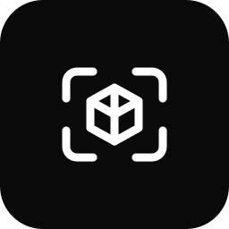
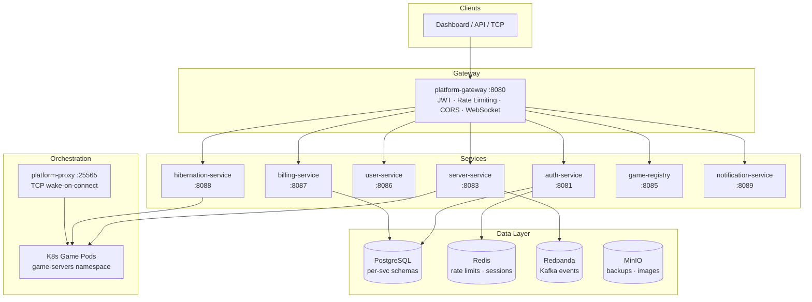
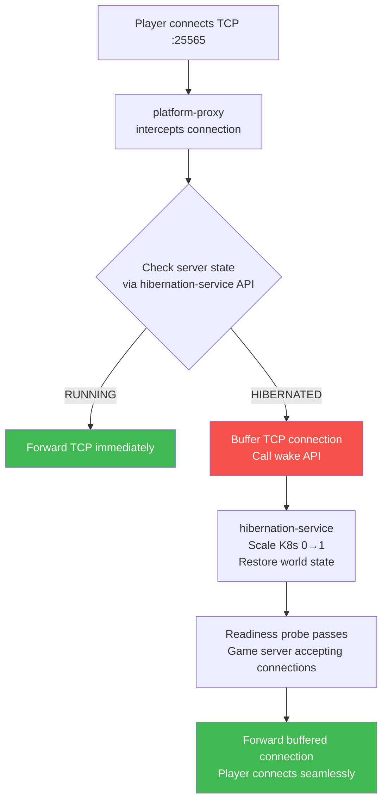
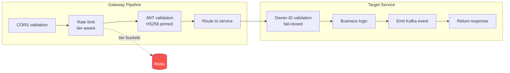
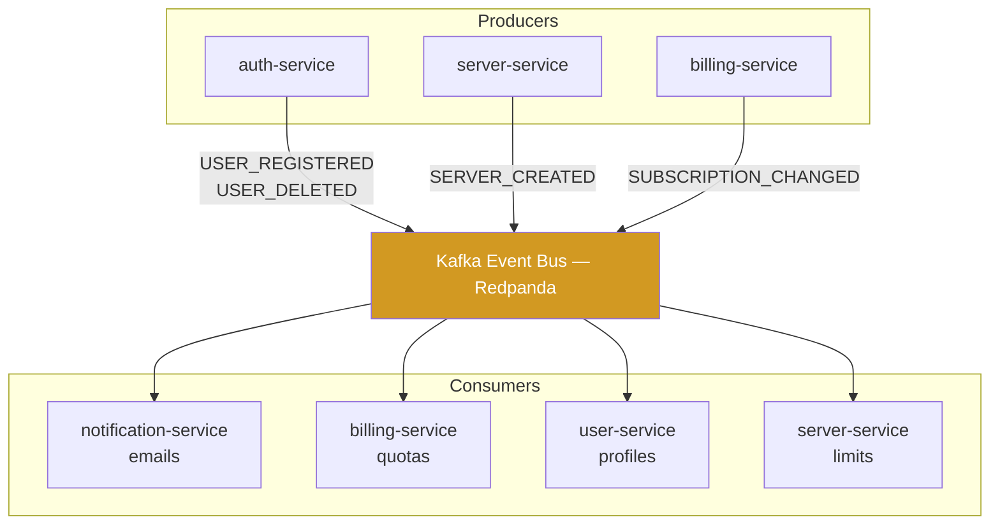
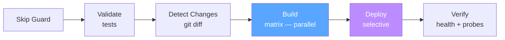
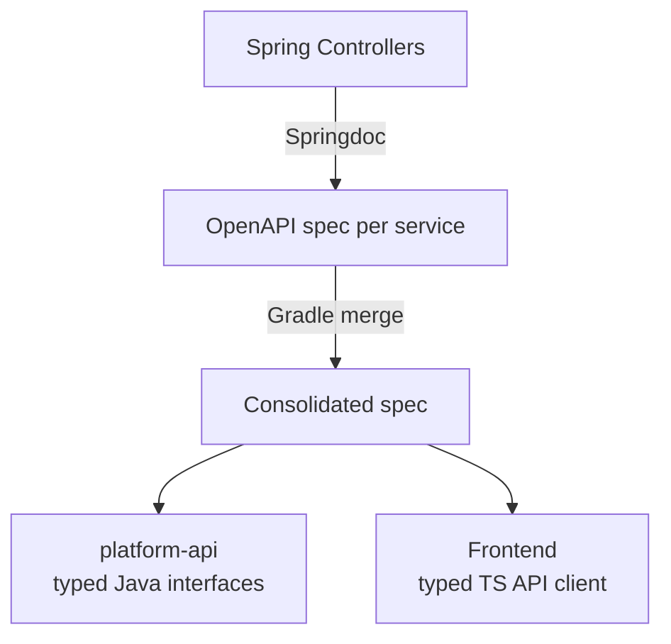

  

<h1 align="center">MetricHost</h1>

  <em>Intelligent game server infrastructure — microservice orchestration, warm-sleep hibernation, and wake-on-connect — built and deployed as a production SaaS.</em>

  
  
  
  
  
  
  
  

---

I designed and built this end-to-end: 10+ Spring Boot microservices, a Kubernetes orchestration layer, Stripe billing, event-driven GDPR compliance, and a 5-stage CI/CD pipeline with selective deploys. Source code is proprietary — this repo documents the architecture and engineering decisions.

---

## At a Glance

| | |
|---|---|
| **What** | Multi-game server hosting platform (Minecraft, Valheim, Terraria, etc.) |
| **Backend** | 10+ Spring Boot microservices, each with its own database schema |
| **Frontend** | Next.js 15 with a custom macOS-inspired desktop UI |
| **Infra** | Kubernetes-orchestrated game server pods with per-tier resource limits |
| **Key innovation** | Warm-sleep hibernation with TCP wake-on-connect (sub-second resume for paid tiers) |

---

## System Architecture

Every service owns its database schema. No shared tables. Services communicate exclusively through typed Kafka events or authenticated internal APIs.

---

## The Problem

Existing game hosting panels (Pterodactyl, AMP) are monoliths. They run everything in one process, can't scale individual components, have no concept of resource-aware scheduling, and treat server hibernation as an afterthought.

When you're running hundreds of game servers across multiple games, you need infrastructure that handles:

- **Resource isolation** — one abusive Minecraft server shouldn't affect a Valheim server
- **Cost efficiency** — idle servers should release compute, not burn CPU at 0 players
- **Instant resume** — a player connecting to a sleeping server shouldn't notice the wake-up
- **Tenant fairness** — free users shouldn't degrade performance for paying users
- **Operational safety** — deploying a billing fix shouldn't restart game servers

## How MetricHost Addresses This

| Concern | Typical Panel (Pterodactyl) | MetricHost |
|---------|---------------------------|-----------|
| Architecture | Monolith (Laravel + Wings) | 10+ independently deployable microservices |
| Game servers | Docker containers, single node | K8s pods with per-tier CPU/memory limits |
| Hibernation | None — servers run 24/7 | Warm-sleep + wake-on-connect |
| Rate limiting | Global fixed limits | Tier-aware, Redis-bucketed |
| Abuse detection | Manual admin intervention | Automated CPU abuse detection + IP tracking |
| Deploys | Full downtime redeploy | Selective — only changed services restart |
| Cross-service comms | Shared database queries | Async Kafka events (decoupled lifecycles) |

---

## Deep Dives

### Cold Start → Server Wake Flow

The most complex subsystem. A player connects to a hibernated server and the wake-up should be invisible.

**Warm sleep** (paid tiers): Server transitions to a `WARM` state via Docker container pausing orchestrated by the `HibernationService`. This avoids killing the process, preserving RAM state and delivering sub-1-second wake times natively tracked by `PlatformMetrics`. 
**Cold boot** (free tier): Server enters the `HIBERNATED` state; state is persisted to MinIO and the container is destroyed → ~30-60s wake.

The `GameProxyServer` is a custom **Netty TCP proxy** using `NioEventLoopGroup`. When it receives a packet for a hibernated server, it adds the connection to a `ConcurrentHashMap` and buffers the bytes. Upon the `HibernationService` publishing a Kafka `WAKE_REQUEST`, the actual K8s pod is spawned by `server-service`. Once the readiness probe passes, Netty flushes the buffer to the fresh pod—achieving a fully seamless wake-on-connect.

---

### Request Lifecycle

Every API request traverses this pipeline:

Rate limiting isn't just "10 requests per second." Each subscription tier gets its own Redis bucket namespace (FREE: 10 req/s, STD: 30 req/s, PRO: 100 req/s). A flood of free-tier requests can never exhaust the rate limit capacity available to paying customers.

Every resource access is fail-closed: the target service validates that the authenticated JWT's owner-ID matches the requested resource before any business logic executes (BOLA/IDOR prevention).

---

### Why Kubernetes (Not Just Docker)

Docker Compose works for 5 game servers. It doesn't handle:

| Problem | Docker Compose | Kubernetes |
|---------|---------------|-----------|
| Scale to 0 (hibernation) | Can't scale replicas | `kubectl scale --replicas=0` natively |
| Per-user resource limits | Manual cgroup config | `resources.limits` per pod spec |
| Rolling restarts | Kill + recreate (downtime) | Zero-downtime rollout |
| Namespace isolation | Flat network | `game-servers` namespace isolated from platform services |
| Service discovery | Manual DNS | Built-in: `billing-service.metrichost.svc` |

Game server pods run in the `game-servers` namespace. Platform services run in `metrichost`. A compromised game server mod can't reach the billing database — enforced by network policy.

---

### Scaling Strategy

Platform services are **stateless** — any instance handles any request, horizontally scalable. Game servers are **stateful** — each pod is a specific user's server with persistent storage.

The hibernation engine is what makes this affordable: instead of 100 servers burning CPU 24/7, you might have 15 running and 85 hibernated at any given time.

---

### Event-Driven Architecture

Services don't call each other synchronously for side effects. Everything propagates through typed Kafka events:

Services are fully decoupled. If notification-service goes down, users still register — the welcome email processes when it recovers.

`USER_DELETED` triggers cascading deletion across all services (GDPR Right to Erasure) without any service needing to know about the others.

---

### CI/CD Pipeline

- **Matrix builds** — each changed service builds on its own runner (parallel)
- **SSH pipe streaming** — `docker save | ssh | ctr import` (no tarball upload/download)
- **Selective restarts** — only changed K8s deployments restart. A billing-service fix never bounces a game server pod
- **Readiness verification** — post-deploy health checks + route probes before marking success

---

### Contract Testing

Frontend and backend can never drift:

If an endpoint changes shape, the build fails before deployment.

---

## Microservices

| Service | Responsibility |
|---------|---------------|
| **platform-gateway** | JWT auth, tier-aware rate limiting (Redis), CORS, WebSocket STOMP routing |
| **auth-service** | Registration, login, JWT issuance, email verification, MFA (TOTP), IP-based abuse detection |
| **server-service** | Game server lifecycle → K8s pods, RCON, file system, backups (MinIO), real-time console (STOMP) |
| **game-registry-service** | Game image catalog, Docker image versions, admin API |
| **user-service** | Profiles, preferences, GDPR export/deletion, tier-based quotas |
| **billing-service** | Stripe subscriptions, plan enforcement, invoices, resource burst add-ons |
| **hibernation-service** | Warm-sleep/cold-hibernate, auto-idle detection, wake triggers |
| **notification-service** | Transactional email (Mailgun), Kafka event consumer |
| **platform-proxy** | TCP proxy (Netty), connection buffering, wake-on-connect |
| **platform-common** | Shared DTOs, entities, exception hierarchy, Kafka event contracts |
| **platform-api** | Auto-generated typed interfaces from merged OpenAPI specs |

---

## Security

| Threat | Mitigation |
|--------|-----------|
| Brute-force auth | IP-based rate limiting, tier-bucketed |
| Multi-account farming | Redis IP counter — 3 registrations/IP/24h, fail-open |
| WebSocket abuse | Separate rate limiter (5 conn/s, burst 10) |
| TCP Connection Bombing | Netty `GameProxyServer` enforces `PROXY_MAX_CONNECTIONS_PER_IP` and `PROXY_MAX_CONNECTIONS_PER_SERVER` atomic counters. Drops fast via `IdleStateHandler` on read/write timeouts. |
| Crypto mining | CPU abuse detection, automated pod termination |
| BOLA/IDOR | Fall-closed ownership validation on every resource via `validateOwnership(status, userId)` |
| JWT confusion | Algorithm pinned to HS256 |
| Info disclosure | Actuator restricted, heapdump/threaddump disabled |
| Service spoofing | M2M API key on all `/internal/**` endpoints |

---

## Frontend

The UI/UX was designed by a frontend developer I brought on and orchestrated — giving them creative freedom on the visual design. I then integrated it with the backend APIs and made it production-grade: auth flows, WebSocket console streaming, API contract enforcement, security hardening, CI/CD, Docker builds, and deployment.

The interface uses a macOS-inspired desktop metaphor: draggable/resizable windows, dock, menu bar, 3D cube hero (Three.js), custom boot screen, real-time server console via WebSocket STOMP, file manager with inline editor, and a full mobile-responsive landing page.

---

## Testing

206 test files across both stacks. No mocks for integration tests — real infrastructure via Testcontainers.

| Layer | Framework | Coverage |
|-------|-----------|----------|
| Unit | JUnit 5 | Business logic, DTOs, validation |
| Integration | Testcontainers | Real PostgreSQL, Redis, Redpanda, MinIO |
| Contract | Spring Cloud Contract | API shape verification against OpenAPI specs |
| Migration | Flyway + TC | Schema migration correctness |
| Frontend | Vitest | Auth, billing, CSRF, session management |

---

## Codebase

| Metric | Count |
|--------|-------|
| **Total Project Scale** | **91,000+ lines of code** running the production cluster |
| Backend (Java) | ~43,100 lines across 507 component files |
| Frontend (TypeScript/TSX) | ~28,300 lines across 126 component files |
| Kubernetes Infrastructure | ~16,800 lines of YAML orchestrations |
| Test code | 22,097 lines across 206 test files |
| Flyway migrations | 46 versioned migrations (~1,400 LOC) |
| CI/CD pipelines | 499-line backend + 229-line frontend |

---

## Author

**Alexandru Cioc** · [@WhitehatD](https://github.com/WhitehatD)

CS @ Maastricht University · Distributed systems · Security-first engineering
