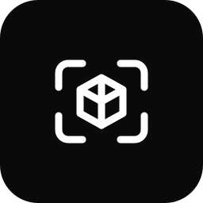
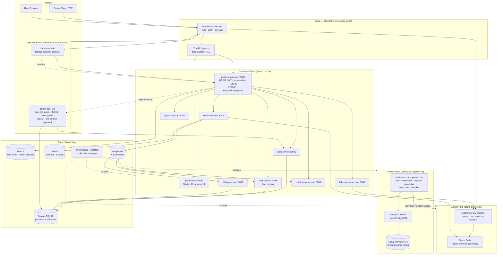
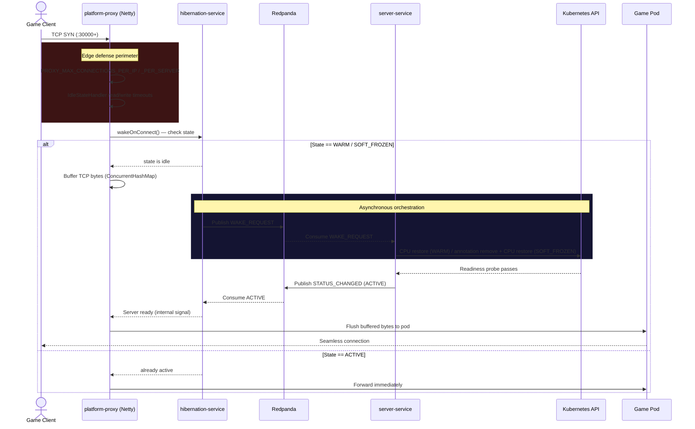
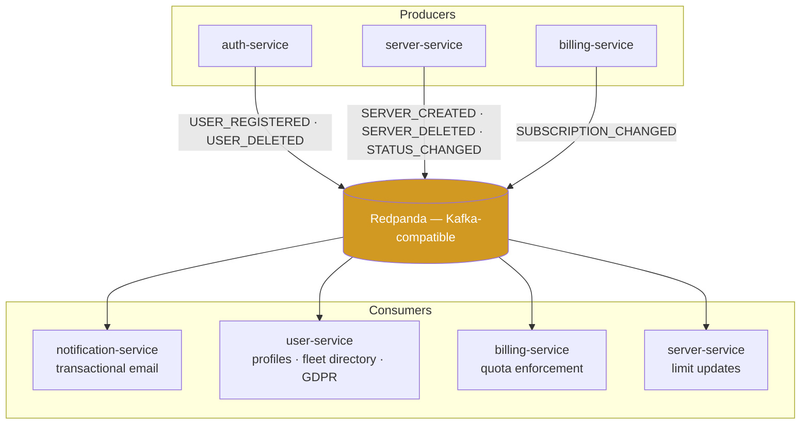
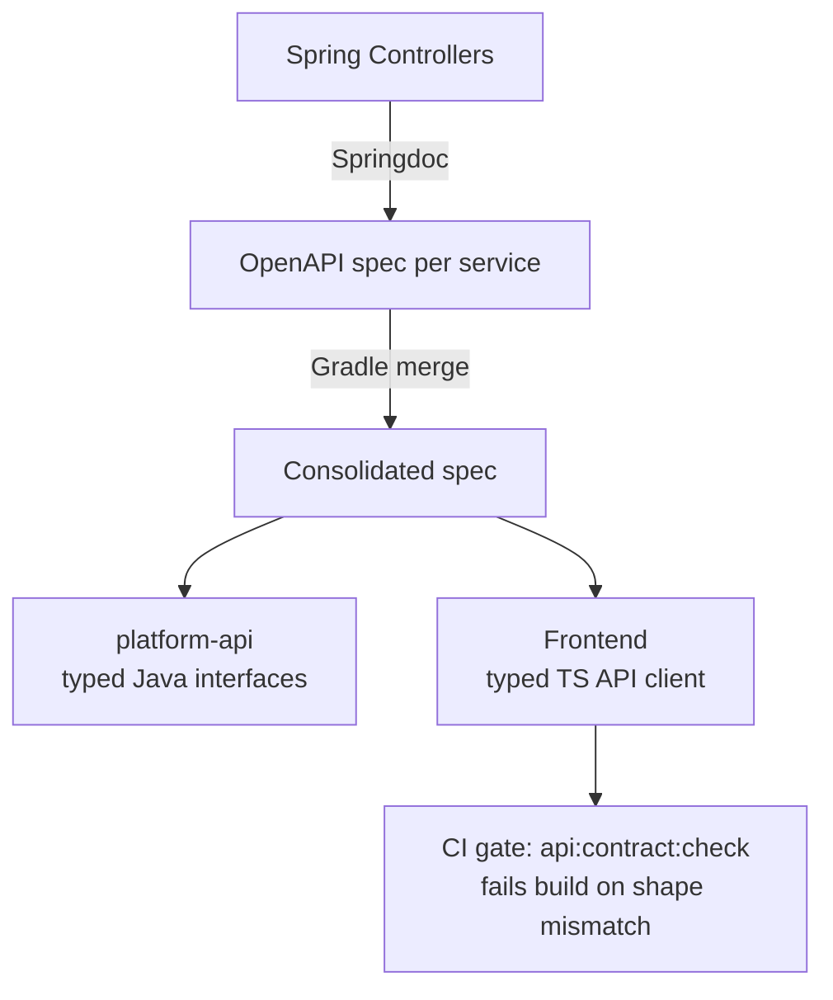
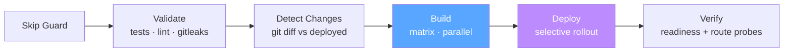

<p align="center">
  
</p>

<h1 align="center">MetricHost</h1>

<p align="center">
  <em>A production, multi-tenant game-server hosting platform built end-to-end — from a Next.js desktop UI and a fleet of Spring Boot microservices, through a Go control plane with Temporal-orchestrated burst provisioning, down to multi-region self-managed Kubernetes, eBPF networking, and full Infrastructure-as-Code.</em>
</p>

<p align="center">
  
  
  
  
  
  
  
  
  
  
  
  
</p>

---

MetricHost is an enterprise-grade, multi-tenant game-server hosting platform — comparable in scope to Pterodactyl plus Vercel, but architected as a distributed system rather than a panel. It supports Minecraft, Valheim, Terraria, Rust, and more.

I architected and built it end-to-end: nine Spring Boot microservices plus a gateway and a TCP proxy, two Go services (a read-only operator API and a control-plane autoscaler), a Next.js user desktop and a separate operator console, Stripe billing, event-driven GDPR compliance, and a six-repository CI/CD system — all running on self-managed multi-region k3s clusters with a flannel→Cilium (eBPF) CNI migration, full Infrastructure-as-Code (Terraform + Ansible + Packer + cloud-init), off-site disaster-recovery backups with verified restores, and a Prometheus/Grafana/Loki observability stack.

Source code is proprietary. This repository documents the architecture and the engineering decisions behind it.

---

## At a Glance

| | |
|---|---|
| **What** | Multi-tenant game-server hosting platform (Minecraft, Valheim, Terraria, Rust, and more) |
| **Backend** | Java 21 · Spring Boot 3.4 · 11 Gradle subprojects (9 microservices + gateway + TCP proxy) · two Go services (operator API + control plane) |
| **Frontend** | Next.js 16 · TypeScript 5 — a macOS-inspired desktop UI for users, plus a separate operator console |
| **Infra** | Self-managed multi-region k3s · Cilium eBPF CNI · Terraform / Ansible / Packer / cloud-init · Temporal-orchestrated burst autoscaler |
| **Key innovation** | A four-rung [hibernation idle ladder](docs/hibernation.md) that reclaims idle RAM and resells it — turning a RAM-constrained business into a density play |
| **Scale** | 6 repositories · 160,000+ lines across application code and Infrastructure-as-Code · multi-node k3s clusters across two live regions |

---

## System Architecture

Five planes, separated by responsibility and by Kubernetes namespace. The customer plane serves the user dashboard and APIs; the operator plane is a physically separate console and Go API; the game plane carries raw TCP to game pods; the control plane provisions capacity; and the data + monitoring plane backs all of them.


```mermaid
graph TB
    subgraph Internet
        Player[Game Client · TCP]
        Browser[User Browser]
        Operator[Operator Browser]
    end

    subgraph Edge["Edge — Cloudflare (zero open ports)"]
        CF[cloudflared Tunnels<br/>TLS · WAF · anycast]
        TRAEFIK[Traefik Ingress<br/>cert-manager TLS]
    end

    subgraph Customer["Customer Plane (metrichost ns)"]
        FE[platform-frontend<br/>Next.js 16 desktop UI]
        GW[platform-gateway :8080<br/>RS256 JWT · tier rate-limit · CORS<br/>STOMP · RegionRoutingFilter]
        AUTH[auth-service :8081]
        SERVER[server-service :8083]
        GAMEREG[game-registry :8085]
        USER[user-service :8086<br/>fleet registry]
        BILLING[billing-service :8087]
        HIBER[hibernation-service :8088]
        NOTIFY[notification-service :8089]
    end

    subgraph Operator["Operator Plane (metrichost-admin-api ns)"]
        ADM_FE[platform-admin<br/>Next.js operator console]
        ADM_API[admin-api · Go<br/>dual pgx pools · JWKS · MFA-gated<br/>RBAC · two-person approval]
    end

    subgraph Game["Game Plane (game-servers ns)"]
        PROXY[platform-proxy :30000+<br/>Netty TCP · wake-on-connect]
        PODS[Game Pods<br/>region-pinned nodeAffinity]
    end

    subgraph Control["Control Plane (metrichost-system ns)"]
        CP[platform-control-plane · Go<br/>burst autoscaler · orphan reconciler<br/>headroom controller]
        TEMPORAL[Temporal Server<br/>+ own PostgreSQL]
        HCLOUD[(Cloud Provider API<br/>dynamic game nodes)]
    end

    subgraph DataMon["Data + Monitoring"]
        PG[(PostgreSQL 16<br/>per-service schemas)]
        REDIS[(Redis 7<br/>rate limits · leader election)]
        KAFKA[(Redpanda<br/>Kafka events)]
        MINIO[(MinIO<br/>backups · exports)]
        MON[Prometheus · Grafana<br/>Loki · Alertmanager]
    end

    Player --> CF --> PROXY --> PODS
    Browser --> CF --> TRAEFIK --> FE & GW
    Operator --> CF --> ADM_FE --> GW

    GW --> AUTH & SERVER & USER & BILLING & HIBER & GAMEREG & NOTIFY
    ADM_FE -. rewrites .-> GW
    GW -. region-routing .-> ADM_API
    ADM_API --> AUTH
    SERVER --> PODS
    HIBER --> PROXY
    CP --> TEMPORAL --> HCLOUD
    CP -->|provision / destroy nodes| Game

    AUTH & USER & BILLING --> PG
    GW --> REDIS
    SERVER --> KAFKA & MINIO
    KAFKA --> NOTIFY & USER & BILLING
    ADM_API --> PG
    MON -.scrapes.-> Customer & Game & Control
```

Each plane is independently deployable and independently failure-isolated. A billing change never restarts a game pod; a compromised game mod cannot reach the platform namespace; the operator console runs at a separate domain behind separate namespacing.

---

## The Problem

Existing game-hosting panels (Pterodactyl, AMP) are monoliths. They run everything in one process, cannot scale individual components, have no concept of resource-aware scheduling, and treat hibernation as an afterthought.

Running hundreds of game servers across multiple game types demands infrastructure that handles:

- **Resource isolation** — one abusive Minecraft server must not affect a Valheim server.
- **Cost efficiency** — idle servers should release compute and memory, not hold RAM at zero players.
- **Instant resume** — a player connecting to a sleeping server should never see "offline."
- **Tenant fairness** — free users must not degrade performance for paying users.
- **Operational safety** — deploying a billing fix must not restart game servers.
- **Geographic reach** — US players should not route through European infrastructure for console, RCON, or file operations.

## How MetricHost Addresses This

| Concern | Typical Panel (Pterodactyl) | MetricHost |
|---|---|---|
| Architecture | Monolith (Laravel + Wings) | 9 Spring Boot microservices + gateway + TCP proxy + 2 Go services |
| Game servers | Docker containers, single node | K8s pods, per-tier CPU/memory limits, region-pinned scheduling |
| Capacity scaling | Manual server addition | Temporal-orchestrated burst provisioning against a cloud API |
| Hibernation | None — servers run 24/7 | Four-rung idle ladder: WARM → SOFT_FROZEN → DEEP_FROZEN → STOPPED |
| Rate limiting | Global fixed limits | Tier-aware, Redis-bucketed per subscription level |
| Abuse detection | Manual admin intervention | Automated CPU-abuse detection, IP tracking, connection-bombing defense |
| Deploys | Full-downtime redeploy | Selective — only changed services restart |
| Cross-service comms | Shared database queries | Async Kafka events on Redpanda (decoupled lifecycles) |
| Multi-region | Single location | Region-direct data planes; transparent gateway routing from a global fleet registry |
| Operator plane | Same UI as users | Separate domain, Go read-only API, RBAC, MFA-gated, two-person approval |

---

## Platform Engineering

Beyond the application, I built and operate the platform it runs on — the layer most "I shipped a SaaS" projects never touch. Full depth in [docs/infrastructure.md](docs/infrastructure.md).

- **Infrastructure-as-Code, end to end.** Terraform provisions cloud VMs, networks, firewalls, SSH keypairs, and load balancers with remote state and per-region, count-gated modules. Ansible hardens every node (SSH config, fail2ban, unattended-upgrades, firewall, kernel params, system limits). Packer builds a pre-hardened golden image so burst workers skip live hardening on first boot. cloud-init handles per-node bootstrap: k3s join, deterministic hostname pinning for fleet reconciliation, and NodeSwap configuration on game nodes.
- **Self-managed multi-region k3s.** An EU production cluster (control-plane node + three infra workers carrying Redpanda and Temporal) plus an independent single-node staging cluster, and a live US-West regional cluster carrying the regional data plane only. A US-East region is provisioned in Terraform but count-gated to zero pending cloud-provider capacity. Clusters are separated by non-overlapping CIDR ranges.
- **Cilium eBPF CNI.** Migrated the network data plane from flannel to Cilium, moving network-policy enforcement onto the eBPF datapath. Identity-based `CiliumNetworkPolicy` governs namespace and pod isolation. The cutover was validated on staging plus a disposable throwaway VM before touching production; stale flannel interfaces were cleaned post-migration.
- **Temporal-driven burst autoscaler.** A Go control plane provisions game nodes on demand through durable Temporal workflows (create node → cloud-init → k3s join → Ansible harden → Ready), with a proactive headroom controller keeping at least one validated worker pre-warmed and an orphan reconciler that only ever deletes control-plane-owned nodes (`metrichost.net/managed-by=controlplane`).
- **Two-tier game node fleet.** A static, Terraform-managed warm baseline worker (always Ready, no cold-burst delay) plus on-demand burst workers. Ownership labels (`metrichost.net/managed-by=terraform` vs `metrichost.net/managed-by=controlplane`) keep the reconciler from ever touching the static baseline.
- **Off-site DR backups with verified restores.** PostgreSQL is dumped, gzip-compressed, and shipped to off-site object storage on a schedule with retention. A separate restore-verification job restores a backup into a throwaway database and checks the schema against the expected Flyway version — a corrupt or empty backup gives false assurance, so restores are verified rather than assumed.
- **Observability per cluster.** Prometheus, Grafana, Loki, and Alertmanager (kube-prometheus stack) run independently in each cluster's `monitoring` namespace. HPA drives horizontal scaling on stateless platform services via metrics-server.
- **Zero-open-port edge.** Cloudflare fronts everything via cloudflared tunnels (no inbound ports on any node), with TLS, WAF, and per-region API subdomains (`api-{region}.example.tld`). Traefik terminates ingress inside each cluster; cert-manager automates certificates.

---

## Deep Dives

### Hibernation: The Idle Ladder

The platform's core economic differentiator. Idle game servers hold RAM they aren't using, and held RAM is unsold margin. MetricHost descends a four-rung idle ladder — **WARM → SOFT_FROZEN → DEEP_FROZEN → STOPPED** — reclaiming progressively more memory the longer a server stays idle, while keeping wake latency low enough that players never see "offline."

```
ACTIVE ─t1─▶ WARM ─t2─▶ SOFT_FROZEN ─t3─▶ DEEP_FROZEN ─t4─▶ STOPPED
full CPU+RAM   CPU 100m    cold RAM paged     process frozen     pod deleted
               RAM resident to NVMe (swap)    to NVMe            cold start
<1s wake       <1s wake    ~1-5s wake         ~1-5s restore      30-60s
```

The state machine is implemented across two enums: `HibernationState` (hibernation lifecycle: `ACTIVE`, `IDLE`, `WARM`, `SOFT_FROZEN`, `DEEP_FROZEN`, `HIBERNATING`, `HIBERNATED`, `WAKING`) and `ServerStatus` (server lifecycle: `STARTING`, `ACTIVE`, `STOPPED`, `WARM`, etc.). `IdleHibernationSweeper` drives the escalation ladder between hibernation states.

SOFT_FROZEN (shipped to production 2026-06-17) uses Kubernetes NodeSwap on cgroup-v2 game nodes: the `swap-reclaim` DaemonSet (in `kube-system`) reads the `metrichost.net/swap-eligible=true` annotation added by `KubernetesOrchestrator.softFreeze()` and sets the game container's `memory.swap.max` and `memory.high` via cgroup v2 directly — because Kubernetes exposes no declarative API for these knobs. This frees idle heap to NVMe swap while the process stays alive; the annotation is removed on wake and the agent restores `memory.high=max` (page-in). The idle RAM is reclaimed and visible to the cluster scheduler for new pods.

Per-game-type profiles in `GameImage` (fields: `warm_after_min`, `soft_freeze_after_min`, `deep_freeze_after_min`, `stop_after_min`, `deepMechanism`) tune the timing and escalation path for each game's RAM footprint and wake tolerance. DEEP_FROZEN currently uses a FAST_RESTART mechanism (graceful stop with state preserved); full CRaC (Java) and CRIU (native games) checkpointing to NVMe is on the roadmap.

**Full architecture including the Always-On cost basis and the DEEP_FROZEN roadmap → [docs/hibernation.md](docs/hibernation.md).**

### Cold Start → Server Wake Flow

A player connects to a sleeping server; the infrastructure intercepts the TCP connection, wakes the specific Kubernetes pod, and forwards the buffered bytes seamlessly. The player sees "waking…", never "offline."


```mermaid
sequenceDiagram
    actor Player as Game Client
    participant Proxy as platform-proxy (Netty)
    participant Hiber as hibernation-service
    participant Kafka as Redpanda
    participant Srv as server-service
    participant K8s as Kubernetes API
    participant PODS as Game Pod

    Player->>Proxy: TCP SYN (:30000+)

    rect rgb(60, 20, 20)
        Note over Proxy: Edge defense perimeter
        Proxy->>Proxy: PROXY_MAX_CONNECTIONS_PER_IP / _PER_SERVER
        Proxy->>Proxy: IdleStateHandler read/write timeouts
    end

    Proxy->>Hiber: wakeOnConnect() — check state

    alt State == WARM / SOFT_FROZEN
        Hiber-->>Proxy: state is idle
        Proxy->>Proxy: Buffer TCP bytes (ConcurrentHashMap)

        rect rgb(20, 20, 50)
            Note over Hiber,K8s: Asynchronous orchestration
            Hiber->>Kafka: Publish WAKE_REQUEST
            Kafka-->>Srv: Consume WAKE_REQUEST
            Srv->>K8s: CPU restore (WARM) / annotation remove + CPU restore (SOFT_FROZEN)
        end

        K8s-->>Srv: Readiness probe passes
        Srv->>Kafka: Publish STATUS_CHANGED (ACTIVE)
        Kafka-->>Hiber: Consume ACTIVE
        Hiber-->>Proxy: Server ready (internal signal)
        Proxy->>PODS: Flush buffered bytes to pod
        PODS-->>Player: Seamless connection

    else State == ACTIVE
        Hiber-->>Proxy: already active
        Proxy->>PODS: Forward immediately
    end
```

### Multi-Region Federation

The federation design is **region-direct, not proxy-through-EU**. Per-server data-plane operations — console WebSocket, RCON, file manager, lifecycle — go directly to the owning regional cluster rather than tunneling through Europe. The frontend reads a global fleet registry to discover each server's region, then routes to `api-{region}.example.tld` over Cloudflare anycast.

A global control plane (EU) owns auth, billing, the fleet registry, and server CREATE. Each region owns its own data plane: gateway, server-service, hibernation, game-registry, platform-proxy, regional PostgreSQL, and regional Redpanda. On the EU gateway, `RegionRoutingFilter` (order 10002, after `RouteToRequestUrlFilter`) resolves the owning region from the server UUID via the fleet directory and transparently rewrites `GATEWAY_REQUEST_URL_ATTR`. It matches routes whose ID matches `server-(service|backups)` and reads the pre-StripPrefix original path from `GATEWAY_ORIGINAL_REQUEST_URL_ATTR` to avoid the rewritten path reaching the regional gateway incorrectly.

**Full architecture, including the dual-write fleet-registry solution and the cross-region Kafka problem → [docs/federation.md](docs/federation.md).**

### Operator Control Plane

The operator console is a physically separate plane: a Next.js operator frontend (`platform-admin`) served at an operator subdomain, backed by a Go REST API (`admin-api`) running in its own `metrichost-admin-api` namespace. It is built for least privilege and accountability rather than convenience.

- **Read-only by default, two pgx pools.** `admin_api_ro` is SELECT-only across the platform schemas. `admin_api_rw` can write to exactly two tables: `auth.user_roles` and `audit.admin_actions`. There is no general-purpose write path into platform data.
- **RBAC: 5 roles × 11 scopes.** Roles: `READ_ONLY`, `SUPPORT`, `BILLING_OPS`, `ADMIN`, `SUPER_ADMIN`. Scopes include `audit:read`, `user:read/write`, `billing:read/write`, `server:read/write`, `impersonate`, `roles:write`, `ops:write`. Every endpoint is scope-gated; `ops:write` (Temporal workflow triggers) is restricted to `SUPER_ADMIN` only.
- **Two-person approval for high-risk ops.** Impersonation and refunds require one admin to initiate and a *different* admin to approve — self-approval is blocked at the handler level. Requests expire after 15 minutes (`ApprovalTTL = 15 * time.Minute`).
- **MFA freshness on every mutation.** Each non-GET request requires a fresh TOTP claim; stale-MFA tokens are rejected fail-closed. Auth is JWT validated against the auth-service JWKS endpoint.
- **Audit trail.** Every operator mutation is written to `audit.admin_actions`.
- **Network isolation.** `CiliumNetworkPolicy` lets admin-api reach auth-service (JWKS) and server-service (M2M SSE metrics) only; it has no path to the game-servers namespace.

### Burst Worker Autoscaler

Capacity is provisioned by `platform-control-plane`, a Go service whose burst-worker lifecycle is a **durable Temporal workflow**, not a bare goroutine. Activities run in sequence: `CreateHetznerServer` → `RecordWorkerCreated` → `WaitForCloudInit` (polls a bootstrap marker via SSH to the private IP with host key pinned in known_hosts) → `WaitForNodeReady` → `RunAnsibleHardening` → finalize. Each step has a `StartToClose` timeout and Temporal-managed retries. If cloud-init fails (intermittent upstream bug; ~30% of provisions), the VM is destroyed and a fresh one is created, up to `maxProvisionAttempts = 3`. If any step fails after node creation, a `Compensate()` call (`DestroyHetznerServer`) prevents cloud resource leaks.

The fleet is two-tier: a static, Terraform-managed warm baseline (always Ready) plus on-demand burst workers. The orphan reconciler skips nodes whose `metrichost.net/managed-by` label is not `controlplane` — Terraform-managed workers never appear in orphan candidates.

> **A real production bug, fixed:** A Temporal activity that accepted a Go `error` interface as a parameter failed to deserialize on Temporal's side — JSON cannot round-trip an `error` interface — so the activity panicked, retried three times, and gave up without marking the workflow failed. The `workflow_operations` row stayed `status=running`, a phantom `in_flight=1` blocked all new provision requests, and game pods stuck Pending. The fix: extract `.Error()` string before `ExecuteActivity`; never pass interface types as Temporal activity arguments.

**Full depth → [docs/infrastructure.md](docs/infrastructure.md).**

### Request Lifecycle

Every API request traverses this pipeline:


```mermaid
flowchart LR
    subgraph Gateway["Gateway pipeline"]
        A[CORS validation] --> B[Rate limit<br/>tier-aware]
        B --> C[JWT validation<br/>RS256 / JWKS]
        C --> D[RegionRouting<br/>fleet directory lookup]
        D --> E[Route to service]
    end

    B -.->|tier buckets| R[(Redis)]
    D -.->|60s TTL cache| FD[(fleet.server_directory)]

    subgraph Target["Target service"]
        F[Owner-ID validation<br/>fail-closed] --> G[Business logic]
        G --> H[Emit Kafka event]
        H --> I[Return response]
    end

    E --> F
    style R fill:#f85149,color:#fff
    style FD fill:#58a6ff,color:#fff
```

JWTs are RS256, signed by auth-service using a private key (`JWT_RSA_PRIVATE_KEY`); the gateway fetches the matching public key from the JWKS endpoint (`/.well-known/jwks.json`) with a 5-minute TTL cache and supports `kid`-based key rotation. The algorithm is pinned — `alg=none` and `alg=HS256` tokens are rejected by the `RsaJwtVerifier`. Rate limiting runs in tier-bucketed Redis namespaces so a free-tier flood cannot exhaust paid capacity. Every resource access is fail-closed: the target service asserts that the authenticated `userId` matches the resource `ownerId` before any business logic runs (BOLA/IDOR prevention).

### Event-Driven Architecture

Services do not call each other synchronously for side effects. Everything propagates through typed Kafka events on Redpanda.


```mermaid
flowchart TD
    subgraph Producers
        AUTH[auth-service]
        SRV[server-service]
        BILL[billing-service]
    end

    BUS[(Redpanda — Kafka-compatible)]

    subgraph Consumers
        NOTIFY[notification-service<br/>transactional email]
        USER[user-service<br/>profiles · fleet directory · GDPR]
        BILL2[billing-service<br/>quota enforcement]
        SRV2[server-service<br/>limit updates]
    end

    AUTH -->|USER_REGISTERED · USER_DELETED| BUS
    SRV -->|SERVER_CREATED · SERVER_DELETED · STATUS_CHANGED| BUS
    BILL -->|SUBSCRIPTION_CHANGED| BUS

    BUS --> NOTIFY & USER & BILL2 & SRV2
    style BUS fill:#d29922,color:#fff
```

`USER_DELETED` triggers cascading deletion across every service — GDPR Right to Erasure — without any service needing to know about the others.

> **Cross-region note:** regional Redpanda is independent per cluster, so a `SERVER_CREATED` event emitted in a regional cluster does not reach the EU bus where the fleet registry consumes. Regional clusters therefore also write the fleet directory via a direct HTTP call to the global user-service at create/lifecycle/delete time. See [docs/federation.md](docs/federation.md).

### Real-Time Streaming (Console + Metrics)

Console output and live metrics stream to the browser over WebSocket/STOMP, traversing Cloudflare → Traefik → platform-gateway → server-service pods.

**The leader-pod broker problem.** `server-service` runs multiple replicas. A single Redis-elected leader polls each pod's metrics every 3 seconds and broadcasts frames to Spring's in-process `SimpleBroker`. With sticky WebSocket upgrades, a browser connected to a non-leader replica never receives a metrics frame — the leader's broker has no path to another replica's subscribers. The "stats never display" bug was exactly this.

**The fan-out fix (applied to both streams).** Each frame is published as an envelope to a Kafka topic: `ConsoleStreamEnvelope` to `console.stream` (6 partitions) and `MetricsStreamEnvelope` to `metrics.stream`, each with a **unique consumer group per pod** (`${console.relay.group-id}` / `${metrics.relay.group-id}`). Every replica's relay consumer (`ConsoleStreamRelayConsumer`, `MetricsRelayConsumer`) picks up the frame and delivers it to its own local STOMP subscribers. Console had this pattern first; metrics was retrofitted to match (PR #181).

**Keepalive arithmetic.** `STREAM_KEEPALIVE_INTERVAL_MS = 8_000` (idle threshold) + `KEEPALIVE_SCHEDULER_INTERVAL_MS = 7_000` (scheduler frequency) = worst-case 15-second gap, safely under the frontend's `HEARTBEAT_TIMEOUT_MS = 20_000`.

**Root-cause isolation.** A four-hop Python STOMP-over-WS probe proved that neither Cloudflare nor Traefik drops STOMP frames — both bugs were purely in server-service, not the edge.

### Contract-Tested API Boundaries

Frontend and backend can never silently drift:


```mermaid
flowchart TD
    A[Spring Controllers] -->|Springdoc| B[OpenAPI spec per service]
    B -->|Gradle merge| C[Consolidated spec]
    C --> D[platform-api<br/>typed Java interfaces]
    C --> E[Frontend<br/>typed TS API client]
    E --> F[CI gate: api:contract:check<br/>fails build on shape mismatch]
```

If an endpoint changes shape, the frontend build fails before any deployment happens.

### CI/CD Pipeline


```mermaid
flowchart LR
    A[Skip Guard] --> B[Validate<br/>tests · lint · gitleaks]
    B --> C[Detect Changes<br/>git diff vs deployed]
    C --> D[Build<br/>matrix · parallel]
    D --> E[Deploy<br/>selective rollout]
    E --> F[Verify<br/>readiness + route probes]
    style D fill:#58a6ff,color:#fff
    style E fill:#bc8cff,color:#fff
```

Each of the six repositories owns an independent CI pipeline. A **skip guard** drops no-op runs. **Validate** runs tests (Testcontainers integration for backend, Vitest for frontend, `go test -race` for Go), a gitleaks secret scan, and type/lint checks. **Detect** diffs against the last deployed commit to identify changed Gradle subprojects or services, so only changed services build. **Build** ships Docker images by SSH pipe (`docker save | ssh | ctr import`) — no tarball round-trip, no registry hop for large images, with BuildKit cache. **Deploy** restarts only the changed Deployments — a billing fix never bounces a game pod. **Verify** runs post-deploy readiness and route health checks before marking the run successful.

---

## Microservices

### Customer plane (`metrichost` namespace)

| Service | Port | Responsibility |
|---|---|---|
| **platform-gateway** | :8080 | RS256 JWT auth (JWKS from auth-service), tier-aware Redis rate limiting, CORS, WebSocket STOMP, `RegionRoutingFilter` |
| **auth-service** | :8081 | Registration, login, RS256 JWT issuance (RSA-2048 private key; JWKS published at `/.well-known/jwks.json`), email verification, MFA (TOTP), IP-based abuse detection |
| **server-service** | :8083 | Game-server lifecycle → K8s pods, RCON, file system, backups (MinIO), real-time console + metrics (STOMP + Kafka fan-out) |
| **game-registry-service** | :8085 | Game image catalog, Docker image versions, modpack registry |
| **user-service** | :8086 | Profiles, preferences, GDPR export/deletion, quotas, fleet directory (global server→region index) |
| **billing-service** | :8087 | Stripe subscriptions, plan enforcement, invoices, resource burst add-ons |
| **hibernation-service** | :8088 | `HibernationState` ladder (WARM / SOFT_FROZEN / DEEP_FROZEN) transitions, `IdleHibernationSweeper`, wake triggers |
| **notification-service** | :8089 | Transactional email (Mailgun), Kafka event consumer |
| **platform-proxy** | :30000+ | Netty TCP proxy (`NioEventLoopGroup`, base port 30000), connection buffering, wake-on-connect |
| **platform-common** | — | Shared DTOs, entities, exception hierarchy, Kafka event contracts (`ConsoleStreamEnvelope`, `MetricsStreamEnvelope`) |
| **platform-api** | — | Auto-generated typed interfaces from merged OpenAPI specs |

### Operator & control plane (separate repos, separate namespaces)

| Service | Stack | Responsibility |
|---|---|---|
| **admin-api** | Go · pgx · JWKS | Read-only operator API. Dual pgx pools (`admin_api_ro` SELECT-only; `admin_api_rw` for `auth.user_roles` + `audit.admin_actions` only). RBAC (5 roles × 11 scopes), two-person approval, MFA freshness, audit trail. Namespace `metrichost-admin-api`. |
| **platform-admin** | Next.js 16 · TS | Operator console at operator subdomain; routes `/api/auth/*` and `/api/admin/*` through platform-gateway via Next.js rewrites. |
| **platform-control-plane** | Go · Temporal · Terraform | Burst-worker autoscaler (Temporal workflows + Hetzner provisioning), orphan reconciler, proactive headroom controller. Namespace `metrichost-system`. |

---

## Security

Defense-in-depth, fail-closed by default.

| Threat | Mitigation |
|---|---|
| JWT confusion / algorithm substitution | RS256 with RSA-2048 keypair; `kid`-based JWKS rotation; `RsaJwtVerifier` pins RS256 — `alg=none` and `alg=HS256` tokens are rejected |
| BOLA / IDOR | Every resource endpoint asserts authenticated `userId == ownerId` before any business logic; fail-closed |
| Tenant starvation | Tier-bucketed Redis rate limits — a free-tier flood cannot exhaust paid capacity |
| Operator privilege abuse | Two-person approval on impersonation + refunds (self-approval blocked, `ApprovalTTL = 15 min`); MFA freshness on all mutations; RBAC 5 roles × 11 scopes |
| Operator data exfiltration | admin-api read-only by default; writes limited to `auth.user_roles` + `audit.admin_actions`; every mutation audited in `audit.admin_actions` |
| Service spoofing | M2M `X-Internal-Key` required on all `/internal/**` endpoints |
| Cross-namespace breach | `CiliumNetworkPolicy` isolates `metrichost`, `game-servers`, `metrichost-admin-api`, `metrichost-system`; game-servers cannot reach the platform namespace |
| Multi-account farming | Redis IP counter — 3 registrations / IP / 24h; separate WebSocket rate limit |
| Crypto-mining / CPU abuse | Automated CPU-abuse detection → pod termination |
| TCP connection bombing | Netty `GameProxyServer` enforces `PROXY_MAX_CONNECTIONS_PER_IP` + `_PER_SERVER` atomic counters; `IdleStateHandler` fast-drops on read/write timeout |
| Supply chain / boot integrity | Packer golden images (pre-hardened); no secrets in code — all via K8s `secretRef` (envFrom secretRef in pods) |
| Info disclosure | Actuator restricted; heapdump/threaddump disabled |
| Backup loss | Automated off-site PostgreSQL backups (compressed, scheduled, retained) with a restore-verification job |
| Content injection | CSP with a dynamic per-request nonce in the Next.js frontend |
| Swap-related OOM | `swap-reclaim` DaemonSet only lowers `memory.high` on nodes with positive `SwapTotal`; it no-ops on swapless nodes, preventing anon-page throttle without backing store |

---

## Frontend

Two Next.js 16 / TypeScript 5 frontends.

The **user dashboard** (`frontend`, 178 source files, 47,734 lines) uses a macOS-inspired desktop metaphor: draggable/resizable windows, a dock, a menu bar, a real-time server console over WebSocket STOMP, and a file manager with an inline editor. The visual design was produced by a frontend developer I brought on and orchestrated; I owned the backend integration and the production hardening — NextAuth session management with capped retry logic (no infinite refresh loops on auth degradation), CSRF tokens with timing-safe validation, input sanitization, WebSocket reconnect keyed to data arrival rather than connection state, and the API-contract CI gate.

The **operator console** (`platform-admin`, 69 source files, 9,643 lines) is a separate frontend served at the operator subdomain, sharing the same JWT validation path through platform-gateway but a distinct auth tier.

---

## Testing

No mocks for integration tests — real infrastructure via Testcontainers. 2,248 test source files in the Java backend alone.

| Layer | Framework | Coverage |
|---|---|---|
| Unit | JUnit 5 | Business logic, DTOs, validation |
| Integration | Testcontainers | Real PostgreSQL, Redis, Redpanda, MinIO |
| Contract | Spring Cloud Contract + CI gate | API shape verification against OpenAPI specs |
| Migration | Flyway + Testcontainers | Schema migration correctness |
| Frontend | Vitest | Auth, billing, CSRF, session management |
| Go | `go test -race` | Autoscaler logic, provisioner, reconciler, approvals |
| Route integrity | `GatewayRoutePolicyTest` | Each route registered + authenticated correctly (ROUTE-01..N) |

`GatewayRoutePolicyTest` is a regression lock for a class of bug where a route exists in config but is missing from the gateway's public-path allowlist — silently returning 401 to health probes and internal routes.

---

## Codebase

| Component | Stack | Scale |
|---|---|---|
| **frontend** (user) | Next.js 16 · TS 5 | 178 TS/TSX files · 47,734 lines |
| **platform-admin** (operator) | Next.js 16 · TS | 69 TS/TSX files · 9,643 lines |
| **admin-api** | Go · pgx | 95 `.go` files · 16,575 lines |
| **platform-control-plane** | Go · Temporal · Terraform | 270 `.go` files · 64,757 lines |
| **Terraform / cloud-init** | HCL · cloud-init | 16,371 lines |
| **K8s infra manifests** | YAML | 9,584 lines |
| **backend** | Java 21 · Spring Boot 3.4 | 3,325 source + 2,248 test files across 11 Gradle subprojects (>100K lines) |
| **schema** | Flyway | 50+ migration versions across 11 service schemas |

**Total: 6 repositories, 160,000+ lines across application code and Infrastructure-as-Code**, deployed to multi-node k3s clusters across two live regions.

---

## What This Demonstrates

End-to-end ownership from product concept to bare metal:

- **Distributed systems** — event-driven microservices (Kafka/Redpanda), Temporal-orchestrated durable workflows, multi-region region-direct data routing, leader-pod fan-out (per-pod Kafka consumer groups), fail-closed ownership validation, orphan reconciliation with timing-sensitive grace periods.
- **Go services** — a read-only operator API with RBAC, two-person approval, and dual connection pools; a control-plane autoscaler with durable workflows and compensation.
- **Platform / SRE** — self-managed multi-region k3s, Cilium eBPF CNI (`CiliumNetworkPolicy`), Infrastructure-as-Code (Terraform · Ansible · Packer · cloud-init), off-site DR backups with verified restores, burst autoscaling, and a per-cluster observability stack.
- **Backend** — Java 21 / Spring Boot microservices, PostgreSQL per-service schemas, Redis, contract-tested API boundaries, RS256 JWT issuance and JWKS-based verification.
- **Frontend** — Next.js / React / TypeScript with real-time WebSocket UIs, an API-contract CI gate, and production auth-flow hardening — twice (user dashboard + operator console).
- **Security** — RS256 JWT pinning, BOLA/IDOR fail-closed authorization, network namespace isolation, MFA freshness, M2M API keys, two-person approval, automated abuse detection.
- **Economic modeling through systems design** — the hibernation idle ladder is an explicit margin mechanism: reclaim idle RAM, resell it as density, and make otherwise-unviable high-cost regions profitable.

---

## Author

**Alexandru Cioc** · [@WhitehatD](https://github.com/WhitehatD)

Architecture and engineering, end to end — from the Next.js desktop UI to the eBPF datapath and the Temporal provisioning workflows.
