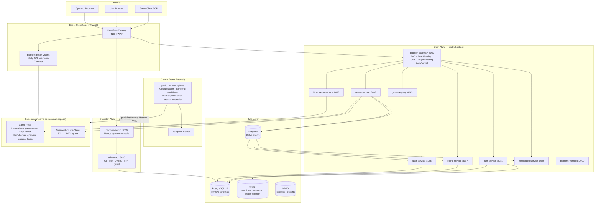
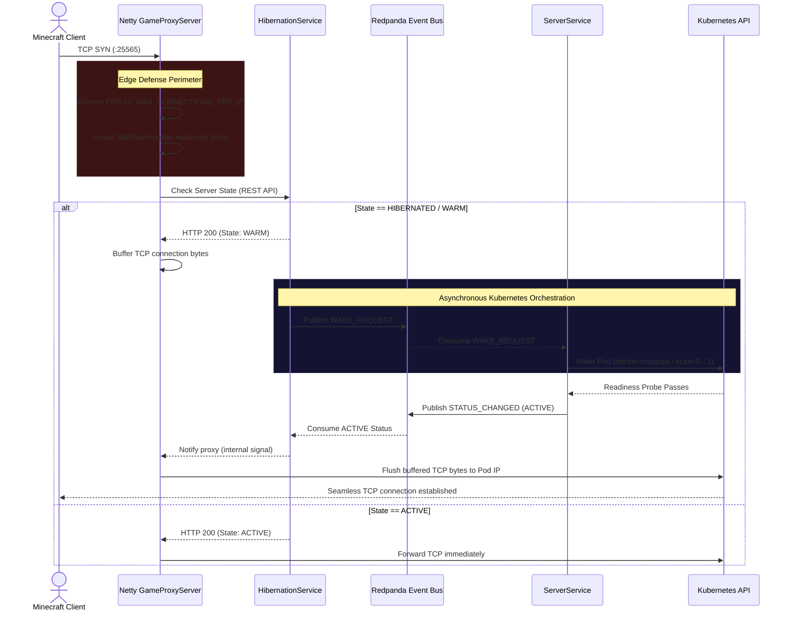
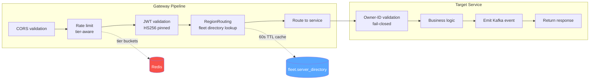
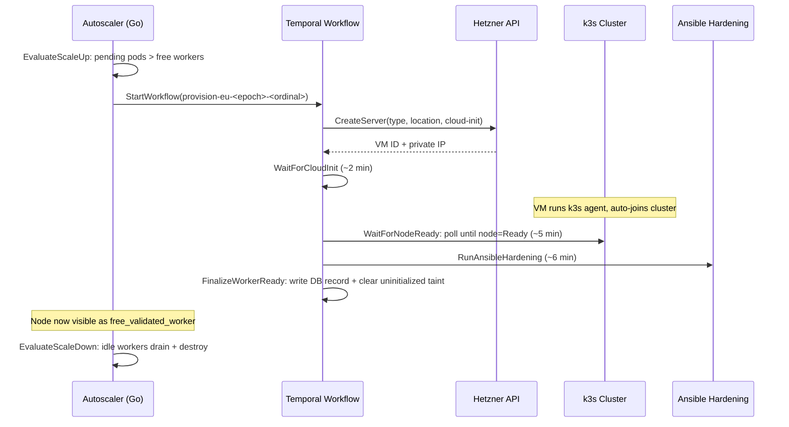
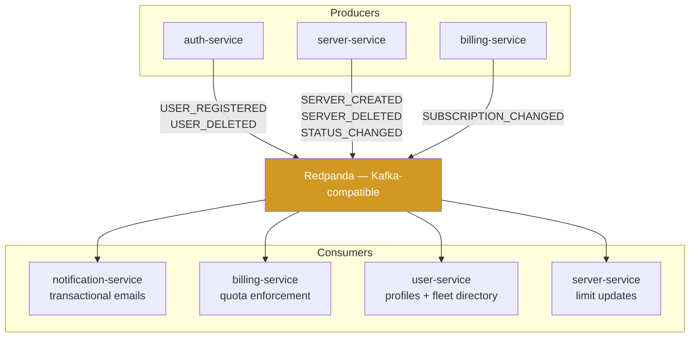
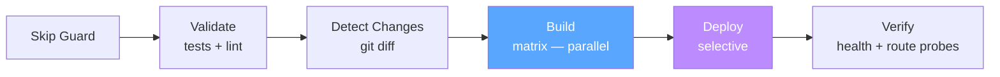
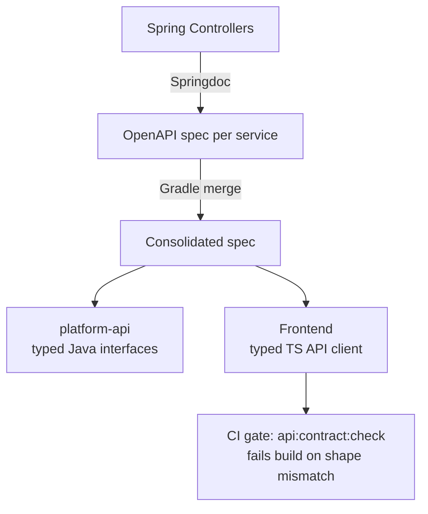

  

<h1 align="center">MetricHost</h1>

  <em>A production game-server hosting platform built end-to-end — from a Next.js dashboard and 10+ Spring Boot microservices down to a Go control-plane autoscaler, Temporal-orchestrated burst provisioning, multi-region Kubernetes federation, eBPF/Cilium networking, and full Infrastructure-as-Code.</em>

  
  
  
  
  
  
  
  
  
  
  
  

---

I designed and built this end-to-end — from application code to bare metal. The platform spans 10+ Spring Boot microservices, a Go-based control-plane autoscaler (Temporal-orchestrated burst provisioning), a separate Go admin API, a Next.js user-facing frontend and operator console, Stripe billing, event-driven GDPR compliance, and a 5-stage CI/CD pipeline — sitting on self-managed multi-node k3s clusters across two regions, a flannel→Cilium (eBPF) CNI migration, full Infrastructure-as-Code (Terraform + Ansible + Packer), disaster-recovery backups, and a Prometheus/Grafana/Loki observability stack.

Source code is proprietary — this repo documents the architecture and engineering decisions.

---

## At a Glance

| | |
|---|---|
| **What** | Multi-game server hosting platform (Minecraft, Valheim, Terraria, Rust, and more) |
| **User plane** | 10+ Spring Boot microservices · Next.js 16 dashboard · Stripe billing |
| **Operator plane** | Go admin API · Next.js operator console (separate domain, separate auth tier) |
| **Control plane** | Go autoscaler · Temporal workflows · Hetzner burst provisioning · orphan reconciliation |
| **Infra** | Self-managed multi-region k3s · eBPF/Cilium · Terraform/Ansible IaC · per-tier PVC storage |
| **Key innovations** | Warm-sleep hibernation with TCP wake-on-connect; transparent multi-region gateway routing; proactive capacity headroom; real-time console/metrics fan-out across pod replicas |

---

## System Architecture

```mermaid
graph TB
    subgraph Internet
        Player[Game Client TCP]
        Browser[User Browser]
        Operator[Operator Browser]
    end

    subgraph Edge["Edge (Cloudflare → Traefik)"]
        CF[Cloudflare Tunnels<br/>TLS + WAF]
        Proxy[platform-proxy :25565<br/>Netty TCP Wake-on-Connect]
    end

    subgraph UserPlane["User Plane — metrichost.net"]
        GW[platform-gateway :8080<br/>JWT · Rate Limiting · CORS · RegionRouting · WebSocket]
        AUTH[auth-service :8081]
        SERVER[server-service :8083]
        USER[user-service :8086]
        BILLING[billing-service :8087]
        HIBER[hibernation-service :8088]
        GAMEREG[game-registry :8085]
        NOTIFY[notification-service :8089]
        FE[platform-frontend :3000]
    end

    subgraph AdminPlane["Operator Plane — metrichost.org"]
        ADM_FE[platform-admin :3000<br/>Next.js operator console]
        ADM_API[admin-api :8090<br/>Go · pgx · JWKS · MFA-gated]
    end

    subgraph ControlPlane["Control Plane (internal)"]
        CP[platform-control-plane<br/>Go autoscaler · Temporal workflows<br/>Hetzner provisioner · orphan reconciler]
        TEMPORAL[Temporal Server]
    end

    subgraph Data["Data Layer"]
        PG[(PostgreSQL 16<br/>per-svc schemas)]
        REDIS[(Redis 7<br/>rate limits · sessions · leader election)]
        KAFKA[(Redpanda<br/>Kafka events)]
        MINIO[(MinIO<br/>backups · exports)]
    end

    subgraph K8s["Kubernetes (game-servers namespace)"]
        PODS[Game Pods<br/>2 containers: game-server + ftp-server<br/>PVC-backed · per-tier resource limits]
        PVC[PersistentVolumeClaims<br/>5Gi → 150Gi by tier]
    end

    Player --> CF --> Proxy --> PODS
    Browser --> CF --> GW
    Operator --> CF --> ADM_FE --> ADM_API

    GW --> AUTH & SERVER & USER & BILLING & HIBER & GAMEREG & NOTIFY
    SERVER --> PODS
    HIBER --> PODS
    CP --> TEMPORAL
    CP -->|provision/destroy Hetzner VMs| K8s

    AUTH --> PG & REDIS
    SERVER --> KAFKA & PVC
    BILLING --> PG
    USER --> PG
    ADM_API --> PG

    SERVER --> KAFKA
    KAFKA --> NOTIFY & USER & BILLING
```

---

## The Problem

Existing game hosting panels (Pterodactyl, AMP) are monoliths. They run everything in one process, can't scale individual components, have no concept of resource-aware scheduling, and treat server hibernation as an afterthought.

When you're running hundreds of game servers across multiple games, you need infrastructure that handles:

- **Resource isolation** — one abusive Minecraft server shouldn't affect a Valheim server
- **Cost efficiency** — idle servers should release compute, not burn CPU at 0 players
- **Instant resume** — a player connecting to a sleeping server shouldn't notice the wake-up
- **Tenant fairness** — free users shouldn't degrade performance for paying users
- **Operational safety** — deploying a billing fix shouldn't restart game servers
- **Geographic reach** — players in the US shouldn't route through European infrastructure

## How MetricHost Addresses This

| Concern | Typical Panel (Pterodactyl) | MetricHost |
|---------|---------------------------|-----------|
| Architecture | Monolith (Laravel + Wings) | 10+ independently deployable microservices + 2 Go services |
| Game servers | Docker containers, single node | K8s pods with per-tier CPU/memory limits + PVC storage |
| Capacity scaling | Manual server addition | Temporal-orchestrated burst provisioning from cloud API |
| Hibernation | None — servers run 24/7 | Warm-sleep + wake-on-connect (sub-1s for paid tiers) |
| Rate limiting | Global fixed limits | Tier-aware, Redis-bucketed per subscription level |
| Abuse detection | Manual admin intervention | Automated CPU abuse detection + IP tracking |
| Deploys | Full downtime redeploy | Selective — only changed services restart |
| Cross-service comms | Shared database queries | Async Kafka events (decoupled lifecycles) |
| Multi-region | Single location | Active US + EU regions with transparent gateway routing |
| Operator plane | Same UI as users | Separate domain, Go API, MFA-gated read-write access |

---

## Platform & Infrastructure Engineering

Beyond the application, I built and operate the platform it runs on — the layer most "I shipped a SaaS" projects never touch.

### Infrastructure-as-Code, End to End

Terraform (Hetzner Cloud provisioning) + Ansible (OS hardening, k3s join, firewall rules) + Packer (golden VM images) + cloud-init. Servers are cattle, not pets — a new control-plane node can be reprovisioned to a known state from scratch. Staging and production environments are independently managed overlays over the same Terraform modules.

### CNI Migration: flannel → Cilium (eBPF)

Migrated the live cluster's network data plane from flannel to Cilium with `kubeProxyReplacement=true`. This replaced kube-proxy's iptables chains with eBPF programs in the kernel — lower latency, per-pod identity-based `CiliumNetworkPolicy`, and proper `hostPort` binding via BPF tc/XDP (which flannel's svclb approach was dropping for Traefik ingress). Validated the full cutover — including the non-obvious gotcha that BPF programs on the public NIC intercept SSH/apiserver traffic on single-NIC VMs — on disposable throwaway clusters before touching production.

### Multi-Region Federation

The platform runs active clusters in Europe (Hetzner Nuremberg) and the US (Hetzner Hillsboro). The architecture separates concerns cleanly:

- **Global plane (EU)**: auth, billing, user profiles, fleet registry, server CREATE — one canonical truth
- **Regional data planes**: per-region Postgres + Redpanda + platform-gateway + game-cloud workers. Each region owns its own game server records and event bus
- **Transparent routing**: the EU gateway's `RegionRoutingFilter` resolves a request's target region from a global `server_directory` index (cached, 60s TTL) and forwards transparently — the frontend makes same-origin calls, the gateway routes to the correct regional cluster
- **Regional pods**: game pods carry a `topology.kubernetes.io/region` hard `requiredDuringSchedulingIgnoredDuringExecution` nodeAffinity — a pod for a US server physically cannot schedule onto a EU node

### Burst Autoscaler

A Go service (platform-control-plane) watches the `game-servers` namespace and orchestrates capacity on demand. Key design elements:

- **Durable provisioning workflows** via Temporal — each burst worker goes through a multi-step workflow: Hetzner VPS creation → cloud-init wait → WaitForNodeReady (k3s auto-join) → Ansible hardening → `FinalizeWorkerReady` DB record. Temporal's durable execution means a workflow survives pod restarts mid-provision.
- **Reactive scaling**: when pending game pods exceed free capacity, `EvaluateScaleUp` triggers provisioning. Burst workers are cloud VMs that join the k3s cluster, run game pods, and are destroyed when demand drops.
- **Proactive headroom**: `EvaluateHeadroom` maintains a configurable minimum of "free validated workers" per region — workers that are Ready, schedulable, have a private IP, no uninitialized taint, and zero game pods. Headroom workers absorb demand spikes without waiting for a provision cycle.
- **Orphan reconciliation**: a 5-minute reconciliation loop detects Hetzner VMs or k3s nodes that aren't in the control-plane's DB (leaked during failed provisions). Grace periods (15 min) prevent the reconciler from deleting workers that are mid-join — a timing hazard that caused a live deadlock (new node joins, reconciler classifies it as OrphanK8sNoRecord, deletes it, autoscaler sees in-flight provision and refuses to retry, game pod stuck Pending).
- **Scaledown floor**: scaledown logic respects the headroom minimum — draining never takes a region below its configured free-worker floor.
- **Safety rails**: CloudHourly budget cap, `MaxParallelProvisions`, cooldown tracking, per-region in-flight dedup, dry-run mode.

### Persistent Game Storage

Game servers use PersistentVolumeClaims backed by Hetzner's CSI driver (`hetzner-volume-game`) in production and `local-path-game` (Rancher's local path provisioner) in staging/dev. Storage sizes are tier-gated: FREE=5 Gi, STARTER=10 Gi, PLUS=25 Gi, PRO=50 Gi, ULTRA=150 Gi.

This replaced an earlier emptyDir + MinIO periodic sync approach. With PVCs: pod restarts and hibernation leave data intact, the volume follows the pod spec (`WaitForFirstConsumer` binding), and MinIO is demoted to backup/export only. Server deletion is a soft-delete with 7-day PVC retention before the purge sweep runs.

### Observability & Alerting

Prometheus + Grafana + Loki + Alertmanager + blackbox probes running in a dedicated monitoring namespace. Alertmanager rules cover k3s-embedded control-plane components (suppressed appropriately — k3s embeds these), CPU throttling (info-level), and custom platform metrics like `metrichost_controlplane_free_validated_workers{region}` and `RegionBelowHeadroom`. HPA drives horizontal pod autoscaling on platform services via metrics-server.

### Edge & Networking

Cloudflare Tunnels for zero-open-port ingress and SSH (`cloudflared`) — no inbound ports on any node. Traefik handles TLS termination and routing inside the cluster. cert-manager automates Let's Encrypt certificates. `CiliumNetworkPolicy` enforces namespace isolation between the `metrichost` (platform services), `game-servers`, `metrichost-admin-api`, and `metrichost-system` (control-plane + Temporal) namespaces — a compromised game server mod cannot reach the billing database.

### Disaster Recovery

Automated, encrypted, off-site PostgreSQL backups with verified restores. A backup that silently produces an empty file is caught before it's trusted — the restore verification step is not optional. Zero-day retention gap is a design constraint, not an afterthought.

---

## Deep Dives

### Cold Start → Server Wake Flow

The most complex user-plane subsystem and the platform's core differentiator. A player connects to a sleeping server; the infrastructure intercepts, wakes the specific Kubernetes pod, and forwards the buffered TCP context seamlessly.

```mermaid
sequenceDiagram
    actor Player as Minecraft Client
    participant Proxy as Netty GameProxyServer
    participant Hiber as HibernationService
    participant Kafka as Redpanda Event Bus
    participant Srv as ServerService
    participant K8s as Kubernetes API

    Player->>Proxy: TCP SYN (:25565)

    rect rgb(60, 20, 20)
        Note over Proxy: Edge Defense Perimeter
        Proxy->>Proxy: Enforce PROXY_MAX_CONNECTIONS_PER_IP
        Proxy->>Proxy: Assert IdleStateHandler read/write limits
    end

    Proxy->>Hiber: Check Server State (REST API)

    alt State == HIBERNATED / WARM
        Hiber-->>Proxy: HTTP 200 (State: WARM)
        Proxy->>Proxy: Buffer TCP connection bytes

        rect rgb(20, 20, 50)
            Note over Hiber,K8s: Asynchronous Kubernetes Orchestration
            Hiber->>Kafka: Publish WAKE_REQUEST
            Kafka-->>Srv: Consume WAKE_REQUEST
            Srv->>K8s: Wake Pod (docker-unpause / scale 0→1)
        end

        K8s-->>Srv: Readiness Probe Passes
        Srv->>Kafka: Publish STATUS_CHANGED (ACTIVE)
        Kafka-->>Hiber: Consume ACTIVE Status

        Hiber-->>Proxy: Notify proxy (internal signal)
        Proxy->>K8s: Flush buffered TCP bytes to Pod IP
        K8s-->>Player: Seamless TCP connection established

    else State == ACTIVE
        Hiber-->>Proxy: HTTP 200 (State: ACTIVE)
        Proxy->>K8s: Forward TCP immediately
    end
```

**Warm sleep** (paid tiers): `HibernationService` issues a Docker container pause against the game pod via the Kubernetes exec API, preserving RAM state. Wake times are sub-1 second, tracked by `PlatformMetrics`. **Cold boot** (free tier): state is persisted to MinIO, the container is destroyed — ~30–60s wake.

`GameProxyServer` is a custom **Netty TCP proxy** using `NioEventLoopGroup`. Connections for hibernated servers go into a `ConcurrentHashMap` buffer. When the pod is Ready, Netty flushes the buffered bytes to the fresh pod — the player's client sees a normal connection.

---

### Request Lifecycle

Every API request traverses this pipeline:

```mermaid
flowchart LR
    subgraph Gateway Pipeline
        A[CORS validation] --> B[Rate limit<br/>tier-aware]
        B --> C[JWT validation<br/>HS256 pinned]
        C --> D[RegionRouting<br/>fleet directory lookup]
        D --> E[Route to service]
    end

    B -.->|tier buckets| R[(Redis)]
    D -.->|60s TTL cache| FD[(fleet.server_directory)]

    subgraph Target Service
        F[Owner-ID validation<br/>fail-closed] --> G[Business logic]
        G --> H[Emit Kafka event]
        H --> I[Return response]
    end

    E --> F

    style R fill:#f85149,color:#fff
    style FD fill:#58a6ff,color:#fff
```

Rate limiting isn't just "10 requests per second." Each subscription tier gets its own Redis bucket namespace (FREE: 10 req/s, STD: 30 req/s, PRO: 100 req/s). A flood of free-tier requests never exhausts the capacity available to paying customers.

Every resource access is fail-closed: the target service validates that the JWT's owner-ID matches the requested resource before any business logic executes (BOLA/IDOR prevention). No ownership match → 403, no exceptions.

---

### Multi-Region Routing

The EU gateway acts as a transparent regional proxy for the entire `/servers` data plane, without requiring the frontend to know about regional topology.

```mermaid
flowchart TD
    Client[Browser / Mobile] -->|same-origin request<br/>/servers/{uuid}/...| EU[EU Gateway<br/>metrichost.net]

    EU -->|RegionRoutingFilter order=10002| RR{Region<br/>Resolution}

    RR -->|POST /servers: read body.region| LOCAL[EU Data Plane<br/>server-service]
    RR -->|GET /servers/{uuid}: fleet dir lookup<br/>60s TTL cache| FD[(fleet.server_directory<br/>EU Postgres)]

    FD -->|region=eu| LOCAL
    FD -->|region=hil| HIL[US-West Gateway<br/>api-hil.metrichost.net]
    FD -->|unknown: fail-safe| LOCAL

    LOCAL -->|serve response| Client
    HIL -->|forward, re-execute StripPrefix| UW[HIL Data Plane<br/>server-service]
    UW -->|serve response| Client
```

The `RegionRoutingFilter` resolves region from a global `fleet.server_directory` maintained in the EU user-service. The directory is populated via a dual-path registration strategy: a Kafka consumer on the local event bus (for EU servers) and a direct internal HTTP call to the EU user-service (for regional clusters where Kafka doesn't cross regions).

All `/servers/**` operations — lifecycle, file manager, console history, RCON, backups, analytics, scheduled tasks — are transparently region-routed by a single filter. The frontend makes same-origin calls to `metrichost.net`; routing is entirely invisible to it.

---

### Real-Time Console & Metrics Streaming

Server console output and live metrics stream to the browser over WebSocket/STOMP, traversing Cloudflare → Traefik → platform-gateway → server-service pods.

**The leader-pod broker problem.** `server-service` runs as 2 replicas. `MetricsPushService` elects one Redis leader pod to poll each game pod's metrics every 3 seconds and publishes frames to Spring's in-process `SimpleBroker`. With sticky WebSocket upgrades, a browser connected to the *non-leader* pod never receives a metrics frame — the leader's broker has no way to reach the other pod's subscribers.

Console output had already solved this via a Kafka fan-out relay (`ConsoleStreamEnvelope` on the `console.stream` topic, per-pod consumer group). Metrics had no equivalent.

**Fix.** A `MetricsStreamEnvelope` → `metrics.stream` Kafka topic → `MetricsRelayConsumer` (per-pod consumer group). Each pod consumes from Kafka and pushes to its own local broker, so every connected subscriber receives frames regardless of which replica is the metrics leader.

**Keepalive timing.** `sendStreamKeepalives` previously ran on a 14-second scheduler with a 15-second client threshold — worst-case gap of 28 seconds, exceeding the frontend's `HEARTBEAT_TIMEOUT_MS=20s`. An idle server triggered a reconnect loop. Fixed: 7-second scheduler + 8-second threshold (worst-case ~15s, well under the timeout).

---

### Burst Autoscaler Internals

The control-plane's provisioning workflow is a Temporal activity chain designed to be restartable at any step:

```mermaid
sequenceDiagram
    participant AutoS as Autoscaler (Go)
    participant Temp as Temporal Workflow
    participant Hetz as Hetzner API
    participant K8s as k3s Cluster
    participant Ans as Ansible Hardening

    AutoS->>AutoS: EvaluateScaleUp: pending pods > free workers
    AutoS->>Temp: StartWorkflow(provision-eu-<epoch>-<ordinal>)

    Temp->>Hetz: CreateServer(type, location, cloud-init)
    Hetz-->>Temp: VM ID + private IP
    Temp->>Temp: WaitForCloudInit (~2 min)
    Note over K8s: VM runs k3s agent, auto-joins cluster
    Temp->>K8s: WaitForNodeReady: poll until node=Ready (~5 min)
    Temp->>Ans: RunAnsibleHardening (~6 min)
    Temp->>Temp: FinalizeWorkerReady: write DB record + clear uninitialized taint

    Note over AutoS: Node now visible as free_validated_worker
    AutoS->>AutoS: EvaluateScaleDown: idle workers drain + destroy
```

**Orphan grace period (critical correctness).** The orphan reconciler runs every 5 minutes and destroys k3s nodes with no DB record. Between `WaitForNodeReady` and `FinalizeWorkerReady`, the node has joined the cluster but has no DB record yet — a ~11-minute window. Without a grace period, the reconciler classifies the just-joined node as an orphan and deletes it, the provision workflow loses its node, and the autoscaler's in-flight dedup prevents a retry → game pods stuck Pending indefinitely. The fix: a 15-minute `recentlyJoinedK8sNodeGracePeriod` skip in the orphan detector, matching the pre-existing grace period for the Hetzner-side orphan path.

---

### Persistent Game Storage Architecture

```mermaid
flowchart LR
    subgraph GamePod["Game Pod (game-servers ns)"]
        GS[game-server container]
        FTP[ftp-server container]
    end

    PVC[PersistentVolumeClaim<br/>server-{uuid}<br/>WaitForFirstConsumer] -->|/data mount| GS
    PVC -->|/data mount| FTP

    subgraph SC["StorageClass"]
        SC_PROD[hetzner-volume-game<br/>csi.hetzner.cloud<br/>Retain]
        SC_DEV[local-path-game<br/>rancher.io/local-path<br/>Retain]
    end

    PVC --> SC_PROD
    PVC -.->|staging/dev| SC_DEV

    subgraph Lifecycle
        START[Server Start] -->|PVC exists → mount| GamePod
        STOP[Server Stop] -->|Pod deleted, PVC persists| PVC
        DELETE[Server Delete] -->|soft-delete, 7-day retention| PURGE[Purge Sweep every 5min]
        PURGE -->|hard-delete DB + PVC + MinIO backup| DONE[Gone]
    end

    MINIO[(MinIO<br/>backups · exports only)]
    GS -->|scheduled backups| MINIO
```

`reclaimPolicy: Retain` on both storage classes means a PVC survives pod deletion — hibernating or stopping a server never risks data loss. The volume only follows the pod (via `WaitForFirstConsumer` topology binding), ensuring scheduling locality on the same node.

---

### Why Kubernetes (Not Just Docker)

Docker Compose works for 5 game servers. It doesn't handle:

| Problem | Docker Compose | Kubernetes |
|---------|---------------|-----------|
| Scale to 0 (hibernation) | Can't scale replicas | `kubectl scale --replicas=0` natively |
| Per-user resource limits | Manual cgroup config | `resources.limits` per pod spec |
| Rolling restarts | Kill + recreate (downtime) | Zero-downtime rollout |
| Namespace isolation | Flat network | `game-servers` namespace isolated from platform services |
| Service discovery | Manual DNS | Built-in: `billing-service.metrichost.svc` |
| Persistent volumes | Volume mounts, manual cleanup | PVC lifecycle with retention policies |
| Regional affinity | Not possible | `nodeAffinity` on `topology.kubernetes.io/region` |

Game server pods run in the `game-servers` namespace. Platform services run in `metrichost`. Control-plane workloads run in `metrichost-system`. Network policies enforce isolation between all namespaces.

---

### Event-Driven Architecture

Services don't call each other synchronously for side effects. Everything propagates through typed Kafka events on Redpanda:

```mermaid
flowchart TD
    subgraph Producers
        AUTH[auth-service]
        SRV[server-service]
        BILL[billing-service]
    end

    BUS[Redpanda — Kafka-compatible]

    subgraph Consumers
        NOTIFY[notification-service<br/>transactional emails]
        BILL2[billing-service<br/>quota enforcement]
        USER[user-service<br/>profiles + fleet directory]
        SRV2[server-service<br/>limit updates]
    end

    AUTH -->|USER_REGISTERED<br/>USER_DELETED| BUS
    SRV -->|SERVER_CREATED<br/>SERVER_DELETED<br/>STATUS_CHANGED| BUS
    BILL -->|SUBSCRIPTION_CHANGED| BUS

    BUS --> NOTIFY
    BUS --> BILL2
    BUS --> USER
    BUS --> SRV2

    style BUS fill:#d29922,color:#fff
```

`USER_DELETED` triggers cascading deletion across all services — GDPR Right to Erasure — without any service knowing about the others. If `notification-service` goes down, users still register; the welcome email processes when it recovers.

---

### CI/CD Pipeline

```mermaid
flowchart LR
    A[Skip Guard] --> B[Validate<br/>tests + lint]
    B --> C[Detect Changes<br/>git diff]
    C --> D[Build<br/>matrix — parallel]
    D --> E[Deploy<br/>selective]
    E --> F[Verify<br/>health + route probes]

    style D fill:#58a6ff,color:#fff
    style E fill:#bc8cff,color:#fff
```

Each of the 5 repositories self-owns its deployment manifests and CI/CD workflow (GitHub Actions).

- **Matrix builds** — each changed service builds on its own runner in parallel
- **SSH pipe streaming** — `docker save | ssh | ctr import` — no tarball intermediary
- **Selective restarts** — only the K8s Deployment for a changed service rolls. A billing fix never bounces a game server pod
- **Environment-aware overlays** — Kustomize overlays (`deploy/overlays/production`, `deploy/overlays/staging`) gate environment-specific hardening. The CI pipeline selects the overlay by `KUSTOMIZE_PATH` env var
- **Readiness verification** — post-deploy health checks and route probes before marking the workflow run successful

---

### Contract Testing

Frontend and backend can never silently drift:

```mermaid
flowchart TD
    A[Spring Controllers] -->|Springdoc| B[OpenAPI spec per service]
    B -->|Gradle merge| C[Consolidated spec]
    C --> D[platform-api<br/>typed Java interfaces]
    C --> E[Frontend<br/>typed TS API client]
    E --> F[CI gate: api:contract:check<br/>fails build on shape mismatch]
```

If an endpoint changes shape, the frontend build fails before any deployment happens.

---

## Services

### User-Facing Microservices (metrichost.net)

| Service | Language | Responsibility |
|---------|----------|---------------|
| **platform-gateway** | Java / Spring | JWT auth, tier-aware rate limiting (Redis), CORS, WebSocket STOMP routing, RegionRoutingFilter |
| **auth-service** | Java / Spring | Registration, login, JWT issuance, email verification, MFA (TOTP), IP-based abuse detection |
| **server-service** | Java / Spring | Game server lifecycle → K8s pods, RCON, file system, backups (MinIO), real-time console/metrics (STOMP + Kafka fan-out) |
| **game-registry-service** | Java / Spring | Game image catalog, Docker image versions, admin API |
| **user-service** | Java / Spring | Profiles, preferences, GDPR export/deletion, tier-based quotas, fleet.server_directory (multi-region index) |
| **billing-service** | Java / Spring | Stripe subscriptions, plan enforcement, invoices, resource burst add-ons |
| **hibernation-service** | Java / Spring | Warm-sleep/cold-hibernate, auto-idle detection, wake triggers |
| **notification-service** | Java / Spring | Transactional email (Mailgun), Kafka event consumer |
| **platform-proxy** | Java / Spring + Netty | TCP proxy, connection buffering, wake-on-connect |
| **platform-common** | Java | Shared DTOs, entities, exception hierarchy, Kafka event contracts |
| **platform-api** | Java | Auto-generated typed interfaces from merged OpenAPI specs |

### Operator & Control Plane (separate repos, separate namespaces)

| Service | Language | Responsibility |
|---------|----------|---------------|
| **admin-api** | Go + pgx | Read-write PostgreSQL access to auth/users/servers/billing/audit schemas. Two pools: ro (SELECT-only) + rw (INSERT/UPDATE on admin tables). MFA freshness required for non-GET operations. JWKS-validated against auth-service. Namespace: `metrichost-admin-api`. |
| **platform-admin** | Next.js 16 | Operator console at metrichost.org. Rewrites through platform-gateway for auth. Separate JWT tier from the user-facing frontend. |
| **platform-control-plane** | Go + Terraform | Burst autoscaler (Temporal workflows + Hetzner provisioner), orphan reconciler, proactive headroom controller, Terraform-based static infrastructure management. Namespace: `metrichost-system`. |

### Admin Plane Security Design

The admin plane runs at a **separate domain** (metrichost.org) behind **separate k8s namespacing**. admin-api has no path to reach the game-servers namespace — `CiliumNetworkPolicy` allows only specific egress ports (5432 Postgres, 8080/8081 to platform services) and restricts ingress to platform-gateway pods only. Direct internet → admin-api is blocked at the network policy layer.

MFA freshness is enforced on every non-GET request: each token carries a `mfa_verified_at` claim and the API rejects calls where that claim is stale beyond the configured freshness window.

---

## Security

| Threat | Mitigation |
|--------|-----------|
| Brute-force auth | IP-based rate limiting, tier-bucketed Redis |
| Multi-account farming | Redis IP counter — 3 registrations/IP/24h |
| WebSocket abuse | Separate rate limiter (5 conn/s, burst 10) |
| TCP connection bombing | Netty `GameProxyServer` enforces `PROXY_MAX_CONNECTIONS_PER_IP` and `PROXY_MAX_CONNECTIONS_PER_SERVER` atomic counters. `IdleStateHandler` drops on read/write timeout. |
| Crypto mining / CPU abuse | Automated CPU abuse detection, pod termination |
| BOLA/IDOR | Fail-closed ownership validation on every resource: `validateOwnership(status, userId)` before any business logic |
| JWT confusion | Algorithm pinned to HS256 (user-plane); RS256 JWKS (admin-plane) |
| Info disclosure | Actuator restricted, heapdump/threaddump disabled |
| Service spoofing | M2M API key (`X-Internal-Api-Key`) on all `/internal/**` endpoints |
| Admin API lateral movement | `CiliumNetworkPolicy`: admin-api can only reach Postgres + platform-gateway; no direct path to game-servers namespace |
| Admin session escalation | MFA freshness window on all admin write operations |
| Cross-namespace k8s breach | Network policies isolate: `metrichost`, `game-servers`, `metrichost-admin-api`, `metrichost-system` — no cross-namespace traffic except explicit policy entries |
| Supply-chain (images) | SHA-pinned images in production k8s deployments; GHCR for Go services |

---

## Frontend

The UI/UX was designed by a frontend developer I brought on and orchestrated — giving them creative freedom on the visual design. I then integrated it with the backend APIs and made it production-grade: auth flows, WebSocket console streaming, API contract enforcement, security hardening, CI/CD, Docker builds, and deployment.

The interface uses a macOS-inspired desktop metaphor: draggable/resizable windows, dock, menu bar, 3D cube hero (Three.js), custom boot screen, real-time server console via WebSocket STOMP, file manager with inline editor, and a full mobile-responsive landing page.

Key technical decisions I owned: NextAuth session management with capped retry logic (prevents infinite refresh loops on auth service degradation), CSRF token generation with timing-safe validation, WebSocket reconnect logic keyed to data arrival (not connection state), and the API contract check gate in CI.

---

## Testing

No mocks for integration tests — real infrastructure via Testcontainers.

| Layer | Framework | Coverage |
|-------|-----------|----------|
| Unit | JUnit 5 | Business logic, DTOs, validation |
| Integration | Testcontainers | Real PostgreSQL, Redis, Redpanda, MinIO |
| Contract | Spring Cloud Contract + CI gate | API shape verification against OpenAPI specs |
| Migration | Flyway + Testcontainers | Schema migration correctness |
| Frontend | Vitest | Auth, billing, CSRF, session management |
| Go | `go test` + `-race` | Autoscaler logic, provisioner, reconciler |
| Route integrity | `GatewayRoutePolicyTest` | Each service route registered + authenticated correctly (ROUTE-01..N) |

The gateway's `GatewayRoutePolicyTest` is a regression lock for a class of bug where a route exists in the application config but is missing from `AuthenticationFilter.isPublicPath` — causing health probes and internal routes to return 401 silently.

---

## Codebase

| Repository | Stack | Scale |
|------------|-------|-------|
| **backend** | Java 21 · Spring Boot 3.4 · 11 Gradle subprojects | 10+ microservices, ~600 Flyway migrations |
| **frontend** | Next.js 16 · TypeScript 5 · React | ~48,000 lines across 178 source files |
| **platform-control-plane** | Go · Temporal · Terraform | ~65,000 lines across 270 Go files |
| **admin-api** | Go · pgx · jwx · chi | ~95 Go files |
| **platform-admin** | Next.js 16 · TypeScript | Separate operator console |
| **K8s manifests** | YAML · Kustomize | 1,200+ manifests across base + per-environment overlays |

Total source base: well over 150,000 lines of code across 5 active repositories, running on a production multi-region cluster.

---

## What This Demonstrates

End-to-end ownership from product concept to bare metal:

- **Distributed systems** — event-driven microservices (Kafka/Redpanda), Temporal-orchestrated durable workflows, multi-region data routing, leader-pod fan-out, fail-closed ownership validation, orphan reconciliation with timing-sensitive grace periods
- **Platform / SRE** — self-managed Kubernetes (k3s), eBPF/Cilium (kubeProxy replacement, CiliumNetworkPolicy), Infrastructure-as-Code (Terraform · Ansible · Packer), disaster recovery, multi-region federation, burst autoscaling, observability stack
- **Backend** — Java 21 / Spring Boot microservices, Go services (control plane + admin API), PostgreSQL, Redis, event sourcing patterns
- **Frontend** — Next.js / React / TypeScript with real-time WebSocket UIs, API contract gates, production auth flow hardening
- **Security** — Defense-in-depth: fail-closed authorization (BOLA/IDOR), network namespace isolation, MFA freshness enforcement, M2M API keys, algorithm-pinned JWTs, automated abuse detection
- **Engineering judgment** — honest trade-offs: proactive headroom vs cost, multi-region routing transparency vs frontend simplicity, orphan reconciler safety vs provisioning liveness

---

## Author

**Alexandru Cioc** · [@WhitehatD](https://github.com/WhitehatD)

CS @ Maastricht University · Platform & infrastructure · Distributed systems · Security-first engineering
