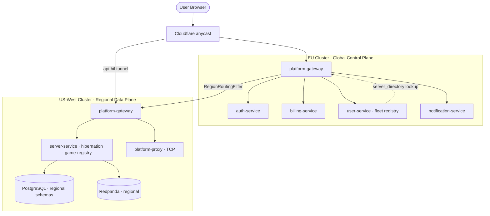
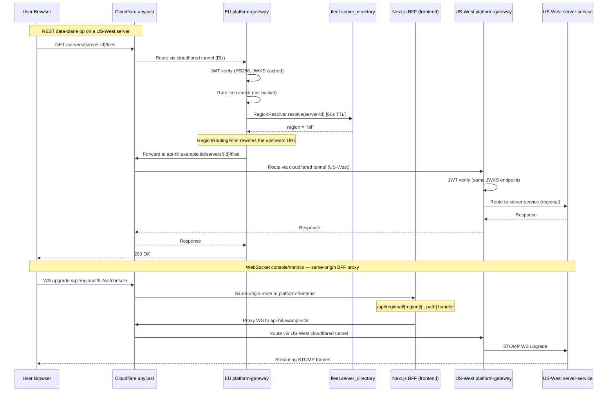

# Multi-Region Federation: Architecture and Design Decisions

MetricHost operates across multiple geographic regions. This document explains the architecture of that federation, the explicit design decisions that shaped it, and the problems that had to be solved at the implementation level.

---

## 1. The Core Design Decision: Region-Direct, Not Proxy-Through-EU

The fundamental choice in multi-region architecture is where per-server data-plane traffic goes. The two options are:

1. **Proxy through a hub.** All requests go to a single EU gateway, which then tunnels them to the regional cluster. Simple to implement; the frontend always talks to one endpoint.
2. **Region-direct.** The frontend discovers each server's region and routes directly to the owning cluster's gateway.

MetricHost chose **region-direct**, for a specific reason: latency is the killer for the operations that matter. Console output, RCON commands, file manager browsing, and live metrics stream are interactive — a 200ms latency penalty in each direction (EU-to-US round trip) makes them visibly sluggish. Backpressure on WebSocket console streams compounds this: buffering 200ms of log output before forwarding introduces perceptible jitter.

Secondary benefits of region-direct:

- **Regional failure isolation.** A US-West cluster issue does not affect EU servers. If proxy-through-EU were used, EU gateway saturation would affect US servers even if the US cluster was healthy.
- **Cloudflare anycast routing.** `api-hil.example.tld` resolves through Cloudflare anycast, which means a player in California talking to a US-West cluster reaches the nearest Cloudflare PoP and then the cloudflared tunnel to the US-West cluster — not a transatlantic hop first.
- **Decoupled regional deploys.** The regional gateway and data-plane services can be upgraded without coordinating with the EU gateway.

---

## 2. The Two Planes



### Global control plane (EU cluster)

The EU cluster runs everything that is inherently global:

| Service | Why global |
|---|---|
| auth-service | SSO semantics: a user's session works across all regions |
| billing-service | Stripe is global; subscription state is a single source of truth |
| user-service | Profiles, GDPR export/deletion, the fleet registry (server→region index), quotas |
| notification-service | Email fanout doesn't need regional proximity |
| platform-gateway (EU) | Routes global operations + serves RegionRoutingFilter for server ops |

Server **CREATE** also goes through EU — the fleet registry must be updated and billing must be consulted before the server is assigned to a region. After creation, lifecycle operations go to the owning regional cluster.

### Regional data plane (per-cluster)

Each regional cluster is a standalone data plane. It runs:

- `platform-gateway` (regional instance)
- `server-service`
- `hibernation-service`
- `game-registry-service`
- `platform-proxy`
- Regional PostgreSQL (with `server`, `hibernation`, `game_registry` schemas)
- Regional Redpanda instance

A regional cluster's gateway, servers, and game pods are completely independent of the EU cluster's availability for lifecycle operations (start, stop, RCON, console, file manager). The EU cluster must be reachable for auth token validation (JWKS is fetched once and cached), billing checks, and fleet registry updates, but those are not on the interactive critical path.

---

## 3. The Fleet Registry

The fleet registry lives in `user-service` (EU-global) in the `fleet` schema, with two tables:

- `fleet.regions` — known region codes and their gateway base URLs.
- `fleet.server_directory` — a thin global index: `server_id → {region, owner_id, name, status}`.

`ServerDirectoryEntry` is explicitly documented as "NOT the authoritative server record" — it is a routing index, not a replica of the server data. The authoritative record lives in the regional cluster's `server` schema.

### How the directory gets populated

There are two write paths, by design:

**Kafka consumer (EU path):** `ServerDirectoryConsumer` in user-service subscribes to `server.created`, `server.status-changed`, and `server.deleted` topics. For servers created in the EU cluster, `server-service` publishes to EU Redpanda, and the consumer upserts the directory.

**Direct HTTP write (regional path):** `FleetRegistryInternalController` exposes `PUT /internal/fleet/server-directory/{serverId}` — an internal endpoint (M2M API key required) for regional `server-service` instances to write directly to the EU user-service. This is necessary because regional Redpanda is independent — a `ServerCreatedEvent` published to the HIL Redpanda does not reach EU Redpanda where `ServerDirectoryConsumer` is listening.

The dual-write is the concrete solution to the cross-region Kafka problem: regional server-service both publishes to its local Kafka (for local consumers: hibernation, notification) and calls the global user-service HTTP endpoint to write the fleet directory entry directly (best-effort — see §8 for the delivery semantics).

### How the directory is queried

`RegionResolver` in `platform-gateway` resolves the region from a server UUID. It calls `user-service`'s fleet directory API with a 60-second TTL cache — so a server that doesn't move regions (which is the common case) will not cause a fleet registry call for every proxied request. If the resolution fails or the server is not found, the filter fails safe by returning the local (EU) region and letting the route's original upstream handle it.

---

## 4. Gateway Region Routing

`RegionRoutingFilter` is a `GlobalFilter` in `platform-gateway`, running at order **10002** (after `RouteToRequestUrlFilter` at 10000, after `WebSocketAuthGatewayFilterFactory` at 10001).

### What it does

For any request whose route ID matches the pattern `server-(service|backups)`, the filter:

1. Reads the server UUID from the request path.
2. Calls `RegionResolver.resolve()` (with fleet directory cache).
3. If the resolved region is non-local (not EU), replaces `GATEWAY_REQUEST_URL_ATTR` with the regional gateway URL.
4. Passes the exchange to the rest of the filter chain — the NettyRoutingFilter picks up the rewritten URL.

The regional gateway at `api-{region}.example.tld` receives a request that looks exactly like a request from the original client — same path, same JWT, same headers — and routes it with its own identical route predicates. The region-routing is transparent to both the regional gateway and the service behind it.

### The pre-StripPrefix path fix (Bug A)

At order 10002, the route's `StripPrefix(1)` and `PrefixPath(/api/v1/servers)` gateway filters have already transformed the request URI. `exchange.getRequest().getURI().getPath()` yields `/api/v1/servers/{id}/...`, not the original `/servers/{id}/...` that the client sent.

The fix: read the original path from `GATEWAY_ORIGINAL_REQUEST_URL_ATTR` — a `LinkedHashSet<URI>` set by `RoutePredicateHandlerMapping` before any filter runs, and never modified. This gives the pre-StripPrefix path. The regional gateway receives `/servers/{id}/...` (not the already-rewritten `/api/v1/servers/...`) and can apply its own identical StripPrefix+PrefixPath rules cleanly.

### The body buffering fix (Bug B)

For `POST /servers` (server create), the filter needs to read the request body to extract an optional `region` field (the client can explicitly request a region). Reactive request bodies are streams consumed once. The fix: `DataBufferUtils.join()` collects all body bytes into a `Mono<byte[]>` with `defaultIfEmpty(EMPTY_BODY)` — so both "has body" and "no body" branches converge into one `flatMap`, and `chain.filter()` is called exactly once. The previous bug (`switchIfEmpty` after the body path) always fired because `chain.filter()` returns `Mono<Void>` which is always empty on success, causing the chain to run twice.

---

## 5. Same-Origin BFF for WebSocket

The region-routing filter handles REST requests. WebSocket upgrade requests are different: the gateway cannot apply a routing filter to a WebSocket upgrade (the filter logic completes before the upgrade handshake), so the upgraded STOMP connection goes to the EU server-service even if the server lives in HIL.

The solution is a same-origin Next.js BFF (Backend-for-Frontend) proxy at `/api/regional/[region]/[...path]/route.ts`. The frontend uses this for all WebSocket-requiring operations on regional servers: console streams, metrics streams.

The BFF:

- Validates `region` against a pattern `/^[a-z0-9]{2,12}$/` before constructing the upstream URL — the upstream is always `api-{region}.example.tld`, never a caller-supplied host.
- Forwards only `Authorization` and `Content-Type` headers. Cookies never leave the `example.tld` origin.
- Uses `AbortSignal.timeout(15000)` to prevent hanging the Next.js process on an unreachable regional gateway.
- Returns `502 REGIONAL_GATEWAY_UNREACHABLE` on connection failure, which the frontend surfaces as a degraded-mode message.

WebSocket upgrades from the browser go to this BFF route (same origin → no CORS preflight), which then establishes the outbound connection to the regional gateway on behalf of the client. The regional gateway's STOMP broker receives a normal WebSocket upgrade from the Next.js server, and the STOMP frames flow from regional `server-service` → regional gateway → BFF → browser.

---

## 6. Terraform Multi-Region

Infrastructure for each region lives in a per-region Terraform module with non-overlapping CIDR ranges:

| Region | Code | Network (example) | Status |
|---|---|---|---|
| EU (production) | `eu` | 10.0.0.0/16 | Live |
| US-West | `hil` | 10.2.0.0/16 | Live |
| US-East | `ash` | 10.1.0.0/16 | Config-ready; `count=0` pending cloud capacity |

Each region module provisions: VMs (control-plane node and workers), a private network, a cloud firewall, SSH keypairs, cloud-init data, and a Cloudflare tunnel (`api-{region}.example.tld`).

Regions are count-gated with `enable_region_{code}` variables. Setting `enable_region_ash=false` (the current state for US-East) provisions no resources in that module without modifying EU configuration. Adding a new region is a matter of adding a new module invocation with the next non-overlapping CIDR block.

Remote state ensures that the Terraform executor always works against the live infrastructure state. A plan-first review step (`executor_plan` job in `deploy-terraform.yml`) runs `terraform plan` against the real state on the executor VM before any apply.

---

## 7. Game Pod Regional Affinity

Game pods scheduled in a regional cluster must only run on nodes in that region. The scheduling constraint is a hard `requiredDuringSchedulingIgnoredDuringExecution` nodeAffinity on `topology.kubernetes.io/region={region_code}`:

```yaml
affinity:
  nodeAffinity:
    requiredDuringSchedulingIgnoredDuringExecution:
      nodeSelectorTerms:
        - matchExpressions:
            - key: topology.kubernetes.io/region
              operator: In
              values: ["hil"]
```

If no node with the required region label exists, the pod is `Unschedulable` rather than landing on a wrong-region node. The provisioner validates the region code before any Hetzner API call and refuses to attach an EU network to a HIL worker — so the nodeAffinity constraint and the provisioner's region validation are belt-and-suspenders: neither one alone is sufficient, but together they make cross-region scheduling impossible.

---

## 8. The Cross-Region Kafka Problem

Each regional cluster runs its own Redpanda instance. Events published to HIL Redpanda are not visible to EU consumers, and vice versa.

This creates a gap for the fleet registry: when a server is created in HIL by the regional `server-service`, it publishes `ServerCreatedEvent` to HIL Redpanda. The `ServerDirectoryConsumer` in EU user-service listens to EU Redpanda — it never sees this event. The fleet directory entry is never created. `RegionResolver` falls back to EU. The EU gateway routes the next request to EU `server-service`, which has no record of the server and returns 404.

**The solution** is the dual-write described in section 3: regional `server-service` calls `PUT /internal/fleet/server-directory/{serverId}` on the EU user-service directly, in addition to publishing to its local Kafka. The HTTP call is **best-effort, not fail-closed**: it is registered as an `afterCommit` transaction synchronization (so it runs only once the server row has committed) and any `RestClientException` is logged and swallowed (`GlobalFleetRegistryClient`) — a transient registry failure must not roll back a server that already exists in the regional database. The consequence of a missed write is bounded and self-correcting: until the directory row exists, `RegionResolver` cannot resolve the server's region and falls back to EU (a 404 for a non-EU server), so directory writes are also re-driven on subsequent status changes. Status updates and deletes flow through the same dual path.

**What's roadmap:** A Kafka MirrorMaker 2 bridge between regional and EU Redpanda would allow the existing Kafka consumer path to work cross-region, eliminating the dual-write and making the regional Kafka events the primary source of truth. This is not yet implemented; the HTTP dual-write is the production solution.

---

## 9. What Stays EU-Global and Why

Some services are deliberately not replicated per-region:

| Service | Reason for keeping global |
|---|---|
| auth-service | A user's token must be valid across all regions. Federated JWKS (EU publishes, all gateways fetch) is simpler and safer than distributing signing keys. |
| billing-service | Stripe is a global API. Subscription state (quota, tier, current period) must have a single source of truth to prevent inconsistent enforcement. |
| user-service / fleet registry | The fleet directory is the router for all cross-region decisions. Replicating it with consistency guarantees would require a distributed consensus mechanism that is out of scope. |
| notification-service | Email delivery latency is measured in seconds; no regional proximity benefit. Centralizing it avoids duplicate delivery. |

---

## 10. Current Live State

**EU cluster:** Multi-node k3s production cluster (control-plane node + three infra workers). Staging cluster is a separate single-node instance.

**US-West (hil) cluster:** Regional data-plane fully deployed. API tunnel health-checked at deployment time. Game pods created in HIL run with `requiredDuringScheduling` nodeAffinity on `topology.kubernetes.io/region=hil`.

**US-East (ash):** Infrastructure module exists in Terraform with non-overlapping CIDRs (`10.1.0.0/16`). `enable_region_ash=false` — count-gated to zero resources pending cloud-provider capacity availability.

**AUS / other regions:** Feasibility depends on regional infrastructure partner and the hibernation margin improvements (SOFT_FROZEN + DEEP_FROZEN) making high-cost regions commercially viable. The Terraform module pattern (add a new module, pick a CIDR block, set count=1) means adding a region is an infrastructure configuration change, not a code change.

---

## Traffic Flow Diagram


