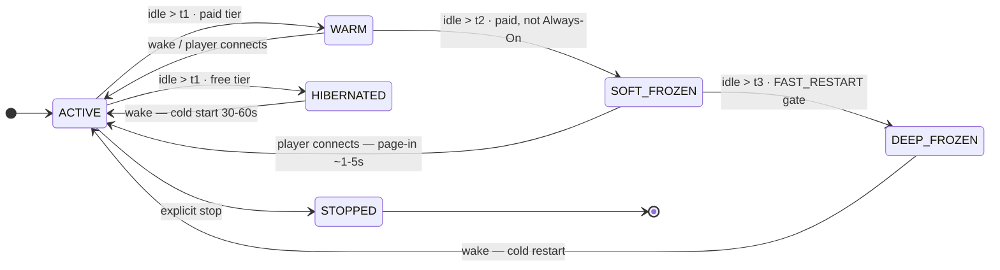

# The Hibernation Architecture: From WARM to DEEP_FROZEN

MetricHost's hibernation system is not a convenience feature — it is the platform's primary cost and density mechanism. This document explains what it does, how it is implemented at the cgroup and Kubernetes layer, and why the design choices were made the way they were.

---

## 1. The Economic Argument

A game server holding 4 GB of heap at zero players is indistinguishable from one at full capacity in terms of RAM cost. On a node with 32 GB of physical RAM, 8 servers that each allocated 4 GB and are now empty consume 100% of the physical memory — leaving nothing for new servers that would actually generate revenue.

Without reclamation, the platform is **RAM-constrained at supply**: the number of concurrent paid servers is bounded by the total physical RAM across the fleet, and idle servers eat the same margin as busy ones. Gross margin on a paid tier that holds memory 24/7 sits at approximately 58% once infra cost and idle wastage are factored in.

With SOFT_FROZEN (cgroup swap reclaim), idle RAM is physically freed and made available to the scheduler for active servers. The constraint shifts from supply to demand, and density multiplies. Paid gross margin climbs toward 86% as a larger fraction of physical RAM is occupied by revenue-generating pods at any given time.

This effect is the only mechanism that makes some regional deployments viable at all. Infrastructure costs in high-cost regions (Australia, Japan) are 3–5× those of EU clusters. At 58% margin and 24/7 RAM hold, those regions are consistently loss-making. At 86% margin with swap reclaim, they reach commercial viability. The hibernation ladder is therefore a prerequisite for geographic expansion, not just a performance optimization.

---

## 2. The Idle Ladder

The system descends four rungs, with progressively more resource reclamation and progressively longer wake latency at each step:

| Rung | CPU | RAM | Wake latency | Mechanism |
|---|---|---|---|---|
| **ACTIVE** | full | full, resident | — | running normally |
| **WARM** | throttled to `100m` | resident | < 1s | in-place CPU resize |
| **SOFT_FROZEN** | `100m` | paged to NVMe swap, process alive | ~1-5s (page-in) | cgroup `memory.high` eviction |
| **DEEP_FROZEN** | n/a | freed (FAST_RESTART: graceful stop) | ~1-5s restore | checkpoint (roadmap: CRaC/CRIU) |
| **STOPPED / HIBERNATED** | n/a | freed, pod deleted | 30-60s cold start | pod delete |



The state machine lives in two enums:

- `HibernationState` (in `platform-common`): `ACTIVE`, `IDLE`, `WARM`, `SOFT_FROZEN`, `DEEP_FROZEN`, `HIBERNATING`, `HIBERNATED`, `WAKING` — the hibernation lifecycle.
- `ServerStatus` (in `platform-common`): `STARTING`, `ACTIVE`, `WARM`, `STOPPED`, etc. — the broader server lifecycle visible to the user.

`IdleHibernationSweeper` in `hibernation-service` runs on a schedule and drives the escalation in three passes:

- **Pass 1:** ACTIVE servers idle past `idleThresholdMinutes` → WARM (or HIBERNATED for FREE tier, skipping the graduated ladder).
- **Pass 2:** WARM servers idle past `softFreezeThresholdMinutes` → SOFT_FROZEN (paid tiers only; Always-On flag skips this).
- **Pass 3:** SOFT_FROZEN servers idle past `deepFreezeThresholdMinutes` → DEEP_FROZEN (gated by `FAST_RESTART_ENABLED` flag; Always-On flag skips this).

The sweeper reads escalation candidates using a `pausedAt`-based query (servers must have been in the rung long enough, not just transitioned) to avoid immediately re-escalating a server that was just paused.

---

## 3. WARM: In-Place CPU Throttle

### Mechanism

`KubernetesOrchestrator.pauseContainer()` sends a strategic-merge-patch to the Kubernetes API that changes the game pod's CPU resource allocation in place. Kubernetes 1.29+ supports in-place pod resize, so the container is not restarted.

```
Before pause:  cpu request/limit = {original value, e.g. "4" cores}
After pause:   cpu request/limit = "100m"  (WARM_CPU_THROTTLE constant)
```

The original CPU values are stashed in pod annotations (`metrichost.net/original-cpu-limit`, `metrichost.net/original-cpu-request`) so they can be restored exactly on wake. `resumeContainer()` reads those annotations and sends the reverse patch. If the annotations are missing (service restarted between pause and resume), it falls back to a 1-core limit as a safe default.

**Memory is explicitly not touched.** The comment in the code is precise: "reducing them below resident heap = OOM kill." The purpose of WARM is to reclaim CPU capacity (freeing it for other pods' CPU scheduling) while keeping all state in memory for instant wake.

### Wake path

Wake = remove the CPU throttle annotation + restore original CPU values via the same in-place resize mechanism. Readiness probe passes within milliseconds; the pod is ready to accept connections.

### 40× CPU reduction

A typical Minecraft or Valheim server configured at 4 cores becomes a 100-millicore pod. The platform regains 3.9 cores per idle server — on a 32-core node, that could be 30+ additional idle servers' worth of CPU back to the pool.

---

## 4. SOFT_FROZEN: NVMe Swap Reclaim

SOFT_FROZEN is the platform's primary density mechanism. It ships the idle server's RAM to NVMe swap while keeping the process alive, so wake is fast (page-in) rather than cold (JVM re-init).

### The NodeSwap limitation

Kubernetes v1.29+ supports node-level swap (`failSwapOn: false` + `LimitedSwap` policy in kubelet config, enabled via cloud-init on game nodes). However, LimitedSwap's behavior for pods with `memory request == memory limit` (which is the case for all game pods — equal request/limit for guaranteed QoS) results in `memory.swap.max = 0` — the container cannot use any swap. Verified on staging 2026-06-17: a running Paper JVM had `swap.max=0` even with NodeSwap enabled.

Kubernetes also exposes no declarative API for `memory.high`. You cannot set it in pod spec, ResourceQuota, or LimitRange.

### The annotation + DaemonSet solution

`KubernetesOrchestrator.softFreeze()` adds the annotation `metrichost.net/swap-eligible=true` to the pod. It does not change CPU (already at 100m from WARM) and does not touch memory resources.

The `swap-reclaim` DaemonSet runs in `kube-system` on every game-capable node. On a 10-second poll, it:

1. Lists pods on its local node.
2. For each pod with `metrichost.net/swap-eligible=true`:
   - Locates the game container's cgroup v2 scope via `containerd://` container ID.
   - Sets `memory.swap.max` = container's `memory.max` limit (overriding kubelet's LimitedSwap `swap.max=0`).
   - If the node has positive `SwapTotal` (checked from `/proc/meminfo`): sets `memory.high` = `RECLAIM_HIGH_PCT%` (default 50%) of the limit to actively drive kernel eviction of cold pages to swap.
   - If `SwapTotal == 0` (node doesn't have swap yet): skips the `memory.high` write. The pod stays swap-eligible and begins reclaiming once the node gains swap capacity.
3. For each pod **without** the annotation (wake, or WARM):
   - Sets `memory.high = max` to restore unrestricted memory access (page-in path).

The DaemonSet is idempotent: it re-derives desired state from the live annotation every loop, so it self-heals after restarts with no persisted state.

### Wake from SOFT_FROZEN

1. Wake trigger (TCP connection via platform-proxy, or explicit API call) → WAKE_REQUEST published to Redpanda.
2. `server-service` consumes WAKE_REQUEST → calls `KubernetesOrchestrator.resumeContainer()`.
3. `resumeContainer()` removes the `metrichost.net/swap-eligible` annotation and restores original CPU values via in-place resize.
4. The `swap-reclaim` DaemonSet detects the annotation is gone → sets `memory.high = max` on the container's cgroup → kernel begins paging memory back in from swap as the JVM accesses it.
5. Readiness probe passes when the game process is responsive. The proxy flushes its buffered TCP bytes.

The player-visible latency is the page-in time: typically 1–5 seconds for a server whose cold pages have migrated to NVMe, compared to <1 second for WARM (no swap involved) or 30–60 seconds for a cold STOPPED start.

---

## 5. DEEP_FROZEN: Current State and Roadmap

### Current implementation: FAST_RESTART

`KubernetesOrchestrator.deepFreeze()` is currently a FAST_RESTART fallback — it performs a graceful in-game save (sending a save-all command via RCON) and then stops the container cleanly, deleting the pod. The server's data is preserved on persistent storage. Wake (`deepRestore()`) recreates the pod from scratch — equivalent to a cold start.

The distinction from `STOPPED` is primarily at the state machine level: DEEP_FROZEN tracks that the escalation ladder led here (after SOFT_FROZEN) rather than a user explicitly stopping the server, so the wake path and billing treatment can differ. The code comments this explicitly: "FAST_RESTART fallback — graceful save + stop + cold restart" with a `TODO(WS-F): Replace with real CRIU/CRaC checkpoint once staging spike validates restore latency + state identity."

### Roadmap: true process checkpointing

The intended mechanism for DEEP_FROZEN is:

- **Java game servers (Minecraft and modpacks):** [CRaC (Coordinated Restore at Checkpoint)](https://wiki.openjdk.org/display/crac). CRaC checkpoints a running JVM to disk, including its heap, JIT-compiled code, and all open file descriptors/sockets. Restore brings the exact JVM state back without re-running JVM initialization, mod loading, or world loading. The restore time is bounded by disk read speed, not by Java startup time — typically 1–5 seconds versus 30–60 seconds for a cold start.
- **Native game servers (Valheim, Terraria, Rust):** [CRIU (Checkpoint/Restore in Userspace)](https://criu.org/) — Linux kernel mechanism to snapshot a process's memory and state to disk and restore it. CRIU cannot be used for Valheim's Steam heartbeat (the process must stay alive to maintain the heartbeat), which is why `GameImage.deepFreezeAfterMin = -1` (never deep-freeze) for those game types in the current profile configuration.

The seam is prepared: the `deepFreeze()` method is a single implementation point with a `TODO` noting exactly how to replace the body with a `checkpointContainer()` helper, and `deepRestore()` calls only `createAndStartContainer()` today — a clear swap point for a checkpoint restore call.

The gate for enabling true DEEP_FROZEN on any game image is the `deepMechanism` field in `GameImage`, which can be `CRAC`, `CRIU`, `FAST_RESTART`, or `SWAP_ONLY`.

---

## 6. Per-Game-Type Hibernation Profiles

Not all games are equal in RAM cost or wake tolerance. A Minecraft modpack at 16 GB of heap cannot share the same hibernate-aggressively profile as a vanilla Terraria server at 512 MB.

`GameImage` (in `server-service`) carries these hibernation profile fields:

| Field | Default | Meaning |
|---|---|---|
| `warmAfterMin` | 5 | Minutes idle in ACTIVE before → WARM |
| `softFreezeAfterMin` | 60 | Minutes idle in WARM before → SOFT_FROZEN |
| `deepFreezeAfterMin` | 240 | Minutes idle in SOFT_FROZEN before → DEEP_FROZEN. `-1` = never (e.g. Valheim). |
| `stopAfterMin` | -1 | Minutes idle in DEEP_FROZEN before → STOPPED. `-1` = never (most paid tiers). |
| `deepMechanism` | FAST_RESTART | Which deep-freeze mechanism to use: `CRAC`, `CRIU`, `FAST_RESTART`, `SWAP_ONLY`. |
| `keepListed` | true | Whether the server remains listed while frozen. |
| `maxWakeSecondsSla` | 10 | Maximum wake latency allowed; drives which rung may be used. |

`HibernationSettings` (per-server overrides, stored in the `hibernation` schema) can further customize `idleThresholdMinutes`, `softFreezeThresholdMinutes`, `deepFreezeThresholdMinutes`, and the `alwaysOnEnabled` flag. These are set at server creation from the owner's tier and can be updated by `BillingEventConsumer` when the subscription changes.

---

## 7. The Always-On Tier

Always-On is not a free feature — it is an explicit opt-out of the SOFT_FROZEN and DEEP_FROZEN rungs, implemented as `alwaysOnEnabled = true` in `HibernationSettings`.

When this flag is set, `IdleHibernationSweeper` skips the WARM→SOFT_FROZEN and SOFT_FROZEN→DEEP_FROZEN escalation checks for that server. The server stays WARM (CPU throttled to 100m, but RAM held resident 24/7).

This is the honest cost basis for the Always-On upsell. The platform's density math depends on idle RAM being reclaimed. A server that holds 4 GB of physical RAM 24/7 (because it opted out of swap) permanently removes that capacity from the pool for other pods. The billing modifier reflects the real infrastructure cost of that reservation.

The flag has no effect on FREE tier servers: those follow the hard-hibernate path directly from ACTIVE (skipping the graduated paid ladder entirely).

---

## 8. The Wake Path: Player Perspective

From a player's point of view, the most important guarantee is that they never see "server offline" when the server is merely sleeping. The platform maintains this by:

1. **platform-proxy** (Netty `NioEventLoopGroup`) listens on the game port (`:25565` for Minecraft). When a new TCP connection arrives, the proxy checks the server's hibernation state before forwarding.
2. If the server is WARM or SOFT_FROZEN (or DEEP_FROZEN in FAST_RESTART mode), the proxy **buffers the TCP bytes** in a per-server `ConcurrentHashMap` and publishes a `WAKE_REQUEST` event to Redpanda.
3. `hibernation-service` consumes the event and orchestrates the wake transition.
4. `server-service` performs the necessary K8s operations (CPU restore, annotation removal).
5. Once the readiness probe passes, `server-service` publishes a `STATUS_CHANGED (ACTIVE)` event.
6. `hibernation-service` consumes the event and signals the proxy.
7. The proxy **flushes the buffered bytes** to the now-ready pod.

The player's game client sends a login packet, receives a buffered "waking" status response, and then gets a seamless handoff to the live server once it's ready. The game port never closes — the player's client does not time out because the proxy holds the TCP connection open.

Edge defense runs at the proxy layer: `PROXY_MAX_CONNECTIONS_PER_IP` and `PROXY_MAX_CONNECTIONS_PER_SERVER` atomic counters prevent connection flooding, and `IdleStateHandler` fast-drops connections that don't complete a login handshake within timeout.

---

## 9. Safety Properties

Several properties are required to make the hibernation system safe under production load:

- **Memory limits are never touched in WARM.** Only CPU is reduced via in-place resize. Reducing memory limits below the resident set would trigger an OOM kill.
- **SOFT_FROZEN only lowers `memory.high` on nodes with actual swap.** The `swap-reclaim` agent checks `/proc/meminfo SwapTotal` every loop. If a node hasn't been provisioned with swap yet, the annotation is noted but `memory.high` is not written — avoiding throttling with nowhere to evict.
- **SOFT_FROZEN annotation is idempotently cleaned on wake.** `resumeContainer()` always removes `metrichost.net/swap-eligible` regardless of what state it was called from. A WARM server waking has no annotation (no-op); a SOFT_FROZEN server has it removed, which the DaemonSet picks up within one poll interval and restores `memory.high=max`.
- **Always-On servers skip the swap ladder.** The `IdleHibernationSweeper` checks `alwaysOnEnabled` before any WARM→SOFT_FROZEN transition attempt.
- **Free-tier servers skip the graduated ladder.** They hard-hibernate directly from ACTIVE (pod stop, full RAM freed), so they never enter WARM or SOFT_FROZEN. This is the most RAM-efficient treatment for free-tier servers, which are expected to be idle the most.
