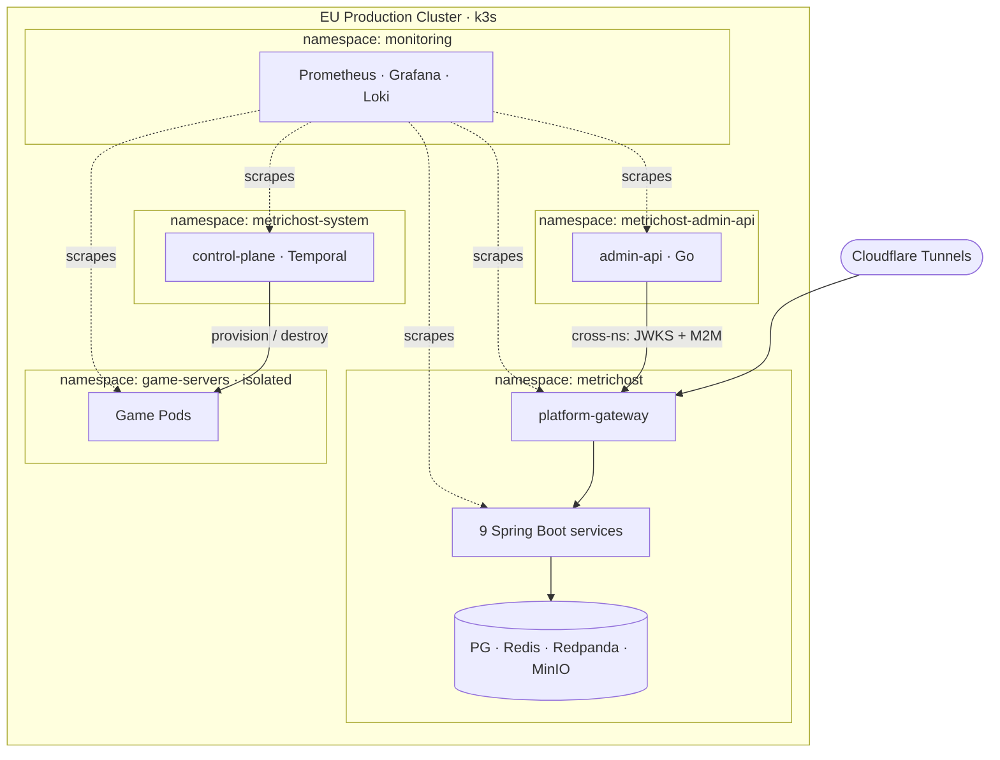
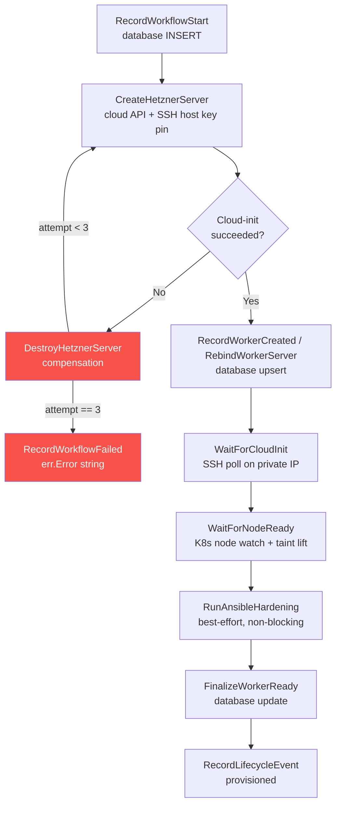

# Platform Infrastructure: IaC, Autoscaling, and Bare-Metal Kubernetes

MetricHost runs on self-managed k3s clusters, not a managed Kubernetes service. This document explains why, what that entailed, how the Infrastructure-as-Code layers fit together, and how the burst autoscaler provisions capacity on demand with durable Temporal workflows.

---

## 1. Why Self-Managed k3s

Managed Kubernetes (EKS, GKE, AKS) imposes constraints that conflict with game-server hosting at this level:

| Constraint | Managed K8s | Self-managed k3s |
|---|---|---|
| Node-level swap | Not available (EKS/GKE disable swap) | `failSwapOn: false` + `LimitedSwap` policy via cloud-init |
| Custom CNI choice | Restricted or unsupported | Cilium eBPF, self-installed |
| hostNetwork game ports | Heavily restricted | Full control |
| Custom cloud-init per node type | Not possible | Per-node type templates |
| IaC-managed node provisioning | Managed node groups only | Terraform + Ansible + Packer, full stack |
| Cost (Hetzner vs. AWS/GCP) | 3-5× more expensive per core | Dedicated bare-metal VMs at Hetzner pricing |

The NodeSwap constraint alone is disqualifying: the SOFT_FROZEN hibernation rung depends on Kubernetes node-level swap, which is not available on managed Kubernetes services. Without it, the platform cannot implement the density mechanism that makes regional expansion viable.

k3s specifically (rather than kubeadm or other distributions) was chosen for its operational simplicity: a single binary for the control-plane node, automatic SQLite/embedded etcd storage for small clusters, and a proven record of stability on single-node and small multi-node configurations.

---

## 2. Cluster Topology

### EU production cluster

- **Control-plane node:** Hosts the k3s server process (API server, scheduler, controller-manager). Not a game-node candidate.
- **Three infra worker nodes:** Each runs the heavy stateful services — Redpanda, Temporal server, Temporal PostgreSQL, and the persistent data plane services. These are Terraform-managed (`metrichost.net/managed-by=terraform`), always present.
- **Game worker nodes:** Terraform-managed static warm baseline (one always-Ready node) plus dynamic burst workers provisioned by the control plane on demand.

### EU staging cluster

A single-node k3s cluster with its own independent Prometheus/Grafana/Loki stack. Staging deploys are gated behind `STAGING_DEPLOY_READY=true` to prevent accidental staging promotion. Rancher runs on production only — staging registers as a downstream cluster and never runs its own Rancher instance.

### US-West (hil) regional cluster

A single-node k3s cluster carrying the regional data plane only: server-service, hibernation-service, game-registry, platform-proxy, regional PostgreSQL, regional Redpanda, and a regional observability stack. The control plane (Temporal, the Go autoscaler, burst worker provisioning) runs EU-only; the burst autoscaler currently watches one cluster. Per-region burst autoscaling is on the roadmap.

### Namespaces

| Namespace | Contents |
|---|---|
| `metrichost` | All Spring Boot platform services (gateway, auth, server, billing, user, hibernation, game-registry, notification) + datastores (PG, Redis, Redpanda, MinIO) |
| `game-servers` | Game pods. NetworkPolicy prevents reaching the `metrichost` namespace. |
| `metrichost-admin-api` | admin-api (Go) + its own PG. Isolated with explicit cross-namespace rules only for specific services. |
| `metrichost-system` | platform-control-plane, Temporal server, Temporal PostgreSQL. |
| `monitoring` | Prometheus, Grafana, Loki, Alertmanager (kube-prometheus stack). |
| `kube-system` | `swap-reclaim` DaemonSet (plus standard k3s components). |



> NetworkPolicy default-denies cross-namespace traffic. `game-servers` cannot reach `metrichost`; `metrichost-admin-api` is allowed only specific ports (auth-service JWKS, server-service M2M). The control plane provisions and reclaims game nodes; monitoring scrapes every namespace.

---

## 3. Terraform Architecture

Terraform is the single source of truth for all static infrastructure. It provisions:

- **VMs (cloud VPS):** The EU cluster is built from flat root modules (`core_vps`, `infra_workers`, `game_worker_eu`); additional regions are encapsulated in reusable regional modules (`region_hil`, `region_ash`). Each provisions a control-plane node and worker nodes. Core server types are driven by an `infra_profile_tag` variable (e.g. `32gb`=cpx62, `16gb`=cpx42) to allow different sizes per environment without modifying per-resource configuration.
- **Networks:** Private networks per region with non-overlapping CIDRs (EU: 10.0.0.0/16, US-West: 10.2.0.0/16, US-East: 10.1.0.0/16).
- **Firewalls:** Hetzner cloud firewalls with per-region allowlists. The `admin_cidr` variable is validated to reject open ranges (`0.0.0.0/0`) — a deliberate safety guard against accidentally-open admin SSH.
- **SSH keypairs:** Per-region, per-environment keypairs. Hetzner rejects duplicate public key values across keys regardless of name, so environments each have their own keypair.
- **Cloudflare tunnels:** `cloudflare_zero_trust_tunnel_cloudflared` resources for each region's API subdomain and SSH access. Tunnel CNAMEs must be `proxied=true` (orange-cloud) — a grey-cloud CNAME resolves to a non-routable `*.cfargotunnel.com` address, and the SSH client hangs at banner exchange.
- **cloud-init data:** Per-node type templates rendered with Terraform `templatefile()`.

**Remote state:** Terraform state is not tracked in the repository. The executor VM (the production control-plane node) holds the live state. CI applies run on the executor via an SSH pipe to avoid exposing state files as CI artifacts.

**Per-region count-gating:** Each regional module is controlled by `enable_region_{code}` variables. Setting `enable_region_ash=false` provisions zero resources for that region without removing the module configuration. This allows a region's infrastructure to be fully defined before cloud-provider capacity is available.

**Static vs. dynamic infra:** Static infra (core nodes, infra workers, static game workers) is managed by Terraform. Dynamic burst workers are provisioned directly by the Go autoscaler against the Hetzner API — they are not Terraform resources and never appear in `terraform state list`.

---

## 4. Ansible: Configuration Hardening

Ansible handles post-provisioning configuration management for all nodes. It runs in two contexts:

1. **Static infra:** Runs as a separate step during initial provisioning and is re-runnable (idempotent) for configuration drift correction.
2. **Burst workers:** Called as the `RunAnsibleHardening` activity within the Temporal `ProvisionWorkerWorkflow` (described in section 7). It runs after the k3s node is Ready, as a best-effort best-practice step — hardening failure does not abort the workflow; the worker is used but flagged.

What Ansible hardens:

- SSH configuration (disable root login, disable password auth, restrict allowed algorithms).
- fail2ban (bans IPs with repeated failed SSH auth; mirrors the Hetzner cloud firewall allowlist to prevent silent DROP vs. REJECT inconsistencies).
- UFW (host-level firewall mirroring the cloud firewall's allowlist — both must be kept in sync; a discrepancy causes silent TCP DROP even when the cloud firewall allows the connection).
- Kernel parameters: system limits for game server workloads (open file descriptors, TCP buffer sizes, etc.).
- Unattended-upgrades: security patches applied automatically.

---

## 5. Packer: Golden Worker Images

Every burst worker is provisioned from a Packer-built golden image rather than running a full Ansible hardening pass on first boot.

The golden image bakes:

- Security hardening (the same Ansible roles applied at image build time).
- The k3s agent binary.
- k3s airgap system images (containerd-importable tarballs for the k3s infrastructure pods) — so nodes join the cluster without pulling images from the internet.
- The Grafana Alloy binary.
- CSI mount tooling (for Hetzner Volumes).

**What is NOT baked:** The k3s join token, core IP, node labels and taints, the pinned SSH host key, and UFW allow-rules all remain in cloud-init — they are per-instance configuration. Game data lives on Hetzner Volumes (CSI), never on node-local storage.

**Selection contract:** The newest snapshot carrying the `metrichost/image=worker` label wins. Terraform reads image selection from `images.tf`; the Go provisioner (`internal/provisioner/hetzner.go`) resolves the worker image by the same label. If no golden image exists, provisioning degrades to a base-image-with-live-Ansible build path rather than failing the burst.

The result: burst workers that boot from the golden image skip the slow Ansible hardening phase at node creation time. The Temporal `RunAnsibleHardening` activity still runs after node join as a backstop (applying any configuration changes that postdate the last image build), but the node becomes schedulable before hardening completes — the admission taint is lifted after `WaitForNodeReady` (~6 minutes before hardening finishes).

---

## 6. cloud-init: Per-Node Bootstrap

cloud-init runs on first boot of every node (both static Terraform-managed and Hetzner API-created burst workers). It handles:

- **k3s join:** Installs k3s with the join URL and token. For burst workers, cloud-init is rendered per-provision with the private core IP and a one-time join token, not a static URL.
- **Hostname pinning (static nodes):** Terraform-managed nodes set a deterministic hostname via cloud-init so a recreated node rejoins k3s under the same fleet name. Burst workers join under their Hetzner-assigned name (`mh-worker-{region}-{id}`); the orphan reconciler matches them to control-plane DB records by Hetzner server ID, not by hostname.
- **SSH host key pinning:** For burst workers, a pre-generated SSH host keypair is injected via cloud-init so `WaitForCloudInit` can verify the SSH connection against a known public key (stored in `known_hosts`) rather than accepting any key. This closes the TOCTOU window between provisioning and verification.
- **NodeSwap configuration for game workers:** Game worker nodes need `failSwapOn: false` and `LimitedSwap` kubelet policy to enable the SOFT_FROZEN hibernation rung. These are set in the kubelet config written by cloud-init. Core and infra nodes do not receive this configuration.

---

## 7. Two-Tier Game Node Fleet

The game node fleet has two distinct layers with different ownership, lifecycle, and autoscaling behavior.

### Static warm baseline (Terraform-managed)

One or more Terraform-managed game worker nodes are always present and Ready. Their label is `metrichost.net/managed-by=terraform`. They absorb baseline load without any burst latency — the first N simultaneous game servers go to the baseline with zero provisioning delay.

The orphan reconciler and the scale-down path explicitly skip these nodes: no node with `metrichost.net/managed-by=terraform` is ever deleted by the control plane.

### Burst workers (control-plane provisioned)

When demand exceeds what the baseline can serve, the `platform-control-plane` autoscaler provisions new nodes via the Hetzner API. These nodes carry `metrichost.net/managed-by=controlplane`. Only they are subject to:

- Orphan deletion (nodes with a Hetzner record but no control-plane DB record, or nodes whose Hetzner record is gone but the DB record remains).
- Scale-down (idle burst workers with no game pods are drained and destroyed after a cooldown period).
- The headroom controller (ensures at least `MinFreeWorkers` validated burst workers remain Ready between demand spikes).

---

## 8. Temporal Workflow Architecture for Burst Provisioning

Burst worker lifecycle is managed by a **durable Temporal workflow**, not a bare goroutine. Temporal's durability guarantees mean that a control-plane pod restart in the middle of a provision does not lose the workflow state — Temporal replays the activity history on recovery.

### ProvisionWorkerWorkflow: steps



**Activity timeouts:**
- Database operations: 1-minute `StartToClose`, automatic retries with 1-second backoff.
- Hetzner API calls: 2-minute `StartToClose`, 2-second retry backoff.
- `WaitForCloudInit`: 12-minute `StartToClose` envelope wrapping an ≈10-minute internal SSH poll; `WaitForNodeReady`: same 12-minute envelope wrapping an ≈5-minute internal node-watch; `RunAnsibleHardening`: 6-minute `StartToClose`. All single-attempt (they poll internally).

**Cloud-init retry loop:** Hetzner's Ubuntu 24.04 + cloud-init ≥ 25.3 stack has an intermittent `DataSourceHetzner` bug where a nil NIC during early boot produces a malformed IPv6 link-local metadata URL, crashing cloud-init before `runcmd` runs. The k3s agent installation never executes; the bootstrap marker is never written; `WaitForCloudInit` exhausts its ≈10-minute internal poll (inside the 12-minute Temporal envelope). The fix is to destroy the failed VM and create a fresh one. `ProvisionWorkerWorkflow` retries the create-wait cycle up to `maxProvisionAttempts = 3` times, reducing the per-provision failure rate from ~30% to ~3%.

**Rebind on retry:** The first attempt inserts a `worker_nodes` row pointing to the first Hetzner server. On retry, that server is destroyed and a new one is created with a new Hetzner ID. The workflow does not insert a new row — it rebinds the existing row (`RebindWorkerServer`) to point at the new server. Skipping this would leave the DB row holding the destroyed server's ID, causing the orphan reconciler to classify the healthy replacement as an unrecorded VPS and destroy it.

**SSH host key pinning:** `CreateHetznerServer` generates a fresh RSA SSH host keypair and injects the private key via cloud-init. The matching public key is written to `known_hosts` in the Hetzner server record (`server.SSHKnownHost`). `WaitForCloudInit` opens an SSH connection to the node's **private** IP (not the public IP — workers join k3s with `--node-ip` set to the private address, so SSH via private IP is what `WaitForCloudInit` needs) with strict host-key checking against the pre-pinned key. Without this, `WaitForCloudInit` accepted any host key (TOFU), making the SSH verification meaningless. The pinning closes a window where a compromised or mis-allocated server could accept an SSH connection.

**A production bug and its fix:** An early version of `RecordWorkflowFailed` accepted a Go `error` interface as a parameter:

```go
// WRONG — JSON cannot round-trip an error interface
workflow.ExecuteActivity(ctx, "RecordWorkflowFailed", someErr)
```

Temporal serializes activity parameters as JSON before storing them in its event history. `json.Marshal(someErr)` produces `{}` (an empty object), and `json.Unmarshal` on the other side can't reconstruct an `error` interface — so the activity panicked. Temporal retried the panicked activity three times, gave up, but did NOT fail the workflow. The `workflow_operations` row stayed `status=running`, a phantom `in_flight=1` blocked all new provision requests, and game pods went Pending indefinitely.

The fix: extract the error message string *before* passing it to `ExecuteActivity`:

```go
// CORRECT — pass the message string, not the error interface
workflow.ExecuteActivity(ctx, "RecordWorkflowFailed", ref, req, workflowErr.Error())
```

Rule: never pass interface types (especially `error`) as Temporal activity arguments. Extract concrete values (`string`, `int`, structs with concrete fields) before the `ExecuteActivity` call.

### Headroom controller

`EvaluateHeadroom` runs on the same tick as the reactive scale-up evaluator. For each configured region, it computes:

```
deficit = MinFreeWorkers(region) - freeValidatedWorkers(region) - inFlightProvisions(region)
```

When `deficit > 0` and the reactive path hasn't already covered it this tick (in-flight provisions from reactive scale-up are counted in `inFlightProvisions`), the headroom controller dispatches additional provisions through the same rails — respecting cooldown, budget, `MaxWorkers` cap, `MaxParallelProvisions`, and dispatch reservations. Headroom provisions are labeled `reason="headroom:<target>"` in logs and metrics to distinguish them from `"pending-capacity"` reactive provisions.

### Orphan reconciler

`ReconcileOrphans` detects and resolves discrepancies between the Hetzner API (what VMs exist) and the control-plane database (what workers are tracked). A node with `metrichost.net/managed-by != controlplane` is immediately skipped — the reconciler never touches Terraform-managed baseline workers.

For control-plane-owned nodes, orphan categories (the `OrphanType` constants in `reconcile.go`):
- **`OrphanHetznerNoRecord`** (`hetzner_no_record`): A Hetzner VPS exists with the right labels but no DB row → destroy (provisioner bug or interrupted create).
- **`OrphanK8sNoRecord`** (`k8s_no_record`): A k3s node exists (labeled `managed-by=controlplane`) but no DB row → delete the node (leaked node from a failed record-step).
- **`OrphanRecordNoNode`** (`record_no_resources`): A DB row exists but *neither* the Hetzner VPS *nor* the k3s node is present → mark the row terminated.

A grace period (`OrphanGracePeriod`, typically several minutes) prevents the reconciler from acting on nodes that are in the middle of a provision workflow.

---

## 9. Cilium eBPF CNI Migration

The platform migrated from flannel (the k3s default CNI) to Cilium eBPF for two reasons:

1. **eBPF policy enforcement:** k3s's built-in NetworkPolicy controller is disabled (`disable-network-policy: true`) so Cilium owns network policy, enforcing it in the kernel via eBPF programs and maps keyed on workload *identity* rather than per-IP iptables rules — which scales as the number of pods and policies grows.
2. **`CiliumNetworkPolicy`:** Identity-based (rather than IP-based) network policies. Cilium assigns a numeric identity to each pod group (namespace + label selector) and enforces policies in BPF maps. The `game-servers` namespace is isolated from `metrichost` by a policy that blocks egress from game pods to the platform namespace — a compromised game mod cannot reach the billing API or any other platform service.

This deployment is **not** run in kube-proxy-replacement mode: the install recipe sets `ipam.mode=kubernetes` + the k3s CNI paths but no `kubeProxyReplacement`, so k3s's kube-proxy stays and continues to handle Service/NodePort routing via iptables (the `platform-proxy` NodePort path depends on exactly that). The win Cilium buys here is eBPF-based, identity-aware *network-policy* enforcement, not kube-proxy elimination.

### Migration methodology

The migration was validated on staging plus a disposable throwaway VM before the production cutover — exercising service routing, NetworkPolicy enforcement, DNS, and inter-pod communication. Post-migration, stale flannel interfaces (`flannel.1`) were cleaned from all nodes.

### Cilium on k3s

k3s uses non-standard CNI paths. The Cilium installation requires:

- `cni.confPath` and `cni.binPath` pointing to k3s's data directory rather than the system-default `/etc/cni/net.d` and `/opt/cni/bin`.
- `ipam.mode=kubernetes` to use k3s's pod CIDR allocations.
- The k3s bundled CNI (flannel) must be disabled before Cilium is installed.

---

## 10. Observability

Each cluster runs an independent observability stack in its `monitoring` namespace:

- **Prometheus:** Scrapes all platform services, game-server pods, kube-state-metrics, and node-exporter (via kube-prometheus DaemonSet). Platform services expose Spring Boot Actuator `/actuator/prometheus` endpoints.
- **Grafana:** Dashboards for per-service metrics, cluster health, game pod resource usage, hibernation ladder transitions, and burst worker provisioning latency.
- **Loki:** Log aggregation, deployed alongside the kube-prometheus stack.
- **Alertmanager:** Alert routing. Watchdog and embedded k3s control-plane component alerts are intentionally suppressed. Real alerts: `CPUThrottlingHigh` (info) when game pods exceed CPU limits.

HPA (Horizontal Pod Autoscaler) is configured for stateless platform services (auth-service, server-service, etc.) using `metrics-server`. Stateful services (Redis, Redpanda, PostgreSQL) are not HPA-managed.

---

## 11. Cloudflare Edge: Zero Open Ports

No node in any cluster has inbound TCP ports open to the internet. All access — both HTTPS/API and SSH — flows through Cloudflare Zero Trust Tunnels (cloudflared).

- **API and WebSocket traffic:** Each regional cluster has a dedicated cloudflared tunnel daemon. The tunnel is defined in Terraform (`cloudflare_zero_trust_tunnel_cloudflared`, `config_src=local`) and authenticated via a Cloudflare-issued credential. Ingress arrives at Cloudflare, travels over the outbound tunnel connection to cloudflared running inside the cluster, and is forwarded to Traefik. Traefik terminates TLS (certificates managed by cert-manager) and routes to the appropriate service.
- **SSH access:** SSH sessions go through Cloudflare Access (`cloudflared access ssh`) to the SSH-specific tunnel endpoints. Root login is disabled; the cloud firewall and host UFW drop all TCP/22 from non-Cloudflare sources.
- **WAF:** Cloudflare WAF sits in front of all HTTPS traffic. Rate limiting and bot protection at the Cloudflare layer are a first line of defense; platform-gateway's tier-aware rate limiting is the second layer.

---

## 12. Disaster Recovery

PostgreSQL is dumped with `pg_dumpall`, gzip-compressed, and shipped to off-site object storage (Cloudflare R2) on a schedule with retention. Because a corrupted or empty backup is worse than a missing one — it provides false assurance — restores are verified rather than assumed: a separate restore-verification job restores a backup into a throwaway database and checks that the restored schema matches the expected Flyway migration version.
